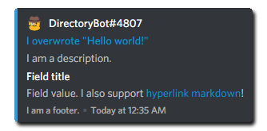

This builder class is used to build an @Discord.Embed (rich embed)
object that will be ready to be sent via @Discord.IMessageChannel.SendMessageAsync*
after @Discord.EmbedBuilder.Build* is called.

---
uid: Discord.EmbedBuilder
example: [*content]
---

#### Basic Usage

The example below builds an embed and sends it to the chat using the
command system.

```cs
[Command("embed")]
public async Task SendRichEmbedAsync()
{
    var embed = new EmbedBuilder
        {
            // Embed property can be set within object initializer
            Title = "Hello world!",
            Description = "I am a description set by initializer."
        };
        // Or with methods
    embed.AddField("Field title",
        "Field value. I also support [hyperlink markdown](https://example.com)!")
        .WithAuthor(Context.Client.CurrentUser)
        .WithFooter(footer => footer.Text = "I am a footer.")
        .WithColor(Color.Blue)
        .WithTitle("I overwrote \"Hello world!\"")
        .WithDescription("I am a description.")
        .WithUrl("https://example.com")
        .WithCurrentTimestamp();
        
    //Your embed needs to be built before it is able to be sent
    await ReplyAsync(embed: embed.Build());
}
```



#### Usage with Local Images

The example below sends an image and has the image embedded in the rich
embed. See @Discord.IMessageChannel.SendFileAsync* for more information
about uploading a file or image.

```cs
[Command("embedimage")]
public async Task SendEmbedWithImageAsync()
{
    var fileName = "image.png";
    var embed = new EmbedBuilder()
        {
            ImageUrl = $"attachment://{fileName}"
        }.Build();
    await Context.Channel.SendFileAsync(fileName, embed: embed);
}
```
