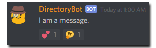

The sample below sends a message and adds an @Discord.Emoji and a custom
@Discord.Emote to the message.

```cs
public async Task SendAndReactAsync(ISocketMessageChannel channel)
{
    var message = await channel.SendMessageAsync("I am a message.");

    // Creates a Unicode-based emoji based on the Unicode string.
    // This is effectively the same as new Emoji("💕").
    var heartEmoji = new Emoji("\U0001f495");
    // Reacts to the message with the Emoji.
    await message.AddReactionAsync(heartEmoji);

    // Parses a custom emote based on the provided Discord emote format.
    // Please note that this does not guarantee the existence of
    // the emote.
    var emote = Emote.Parse("<:thonkang:282745590985523200>");
    // Reacts to the message with the Emote.
    await message.AddReactionAsync(emote);
}
```

#### Result

