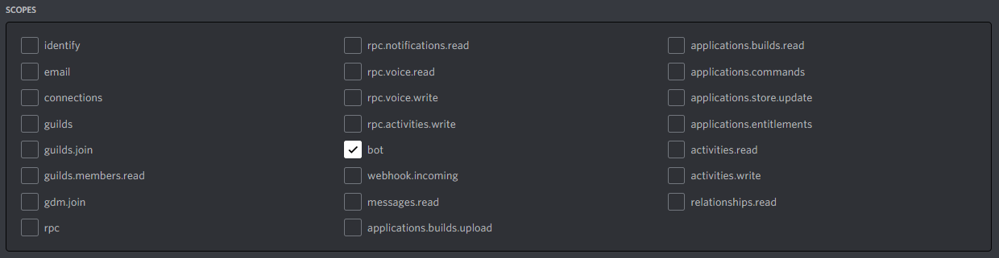
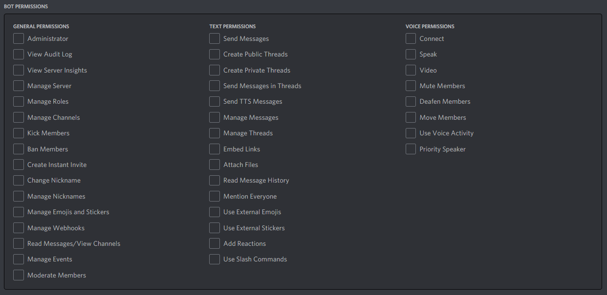
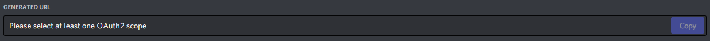
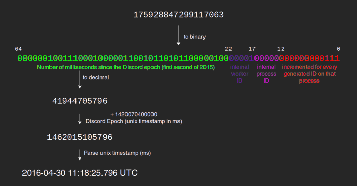
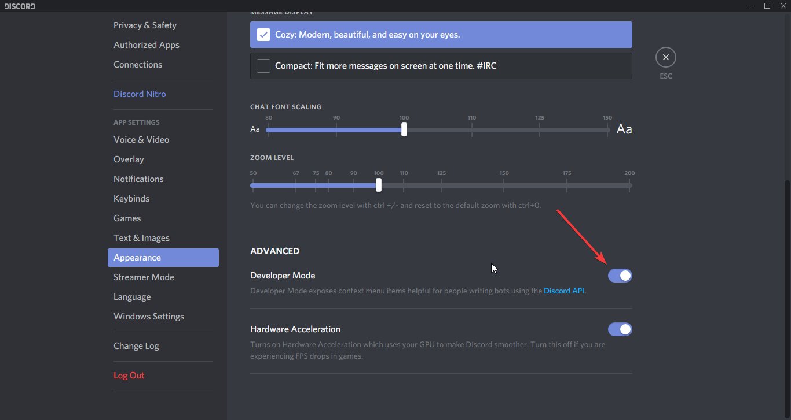
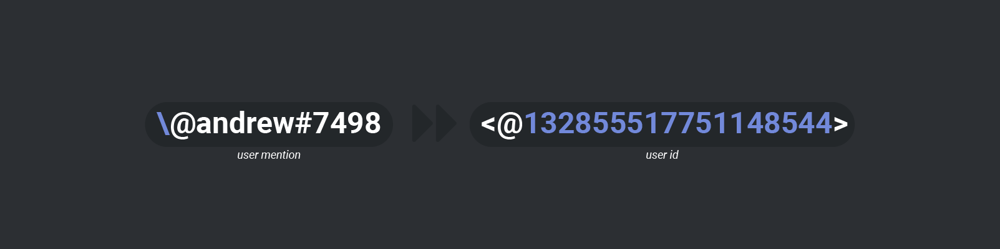
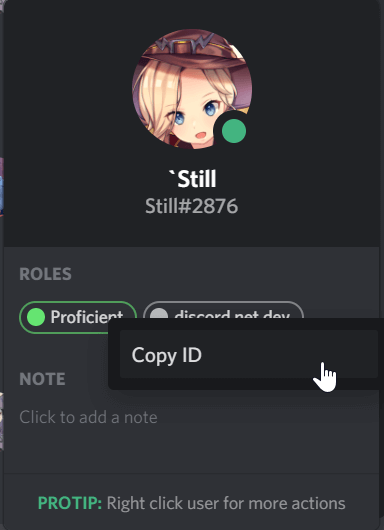

# Getting Started

In this following section, you will find commonly asked questions and
answers about how to get started with Discord.Net, as well as basic
introduction to the Discord API ecosystem.

## How do I add my bot to my guild?

Inviting your bot can be done by using the OAuth2 url generator provided by the [Discord Developer Portal].

Permissions can be granted by selecting the `bot` scope in the scopes section.

A permissions tab will appear below the scope selection,
from which you can pick any permissions your bot may require to function.
When invited, the role this bot is granted will include these permissions.
If you grant no permissions, no role will be created for your bot upon invitation as there is no need for one.

When done selecting permissions, you can use the link below in your browser to invite the bot
to servers where you have the `Manage Server` permission.

If you are planning to play around with slash/context commands,
make sure to check the `application commands` scope before inviting your bot!

> [!NOTE]
> You do not have to kick and reinvite your bot to update permissions/scopes later on.
> Simply reusing the invite link with provided scopes/perms will update it accordingly.

[Discord Developer Portal]: https://discord.com/developers/applications/

## What is a token?

A token is a credential used to log into an account. This information
should be kept **private** and for your eyes only. Anyone with your
token can log into your account. This risk applies to both user
and bot accounts. That also means that you should **never** hardcode
your token or add it into source control, as your identity may be
stolen by scrape bots on the internet that scours through 
constantly to obtain a token.

## What is a client/user/object ID?

Each user and object on Discord has its own snowflake ID generated
based on various conditions.

Anyone can see the ID; it is public. It is merely used to
identify an object in the Discord ecosystem. Many things in the
Discord ecosystem require an ID to retrieve or identify the said
object.

There are 2 common ways to obtain the said ID.

### [Discord Developer Mode](#tab/dev-mode)

By enabling the developer mode you can right click on most objects
to obtain their snowflake IDs (please note that this may not apply to
all objects, such as role IDs, or DM channel IDs).

### [Escape Character](#tab/escape-char)

You can escape an object by using `\` in front the object in the 
Discord client. For example, when you do `\@Example#1234` in chat,
it will return the user ID of the aforementioned user.

***

## How do I get the role ID?

> [!WARNING]
> Right-clicking on the role and copying the ID will **not** work.
> This will only copy the message ID.

There are several common ways to do this:

1. Right click on the role either in the Server Settings
   or in the user's role list (recommended).  
   
2. Make the role mentionable and mention the role, and escape it
  using the `\` character in front.
3. Inspect the roles collection within the guild via your debugger.
