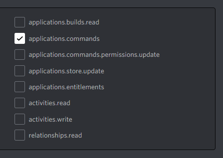

# Interactions basics, where to get started

This section answers basic questions and common mistakes in handling application commands, and responding to them.

## What's the difference between RespondAsync, DeferAsync and FollowupAsync?

The difference between these 3 functions is in how you handle the command response.
[RespondAsync] and
[DeferAsync] let the API know you have succesfully received the command. This is also called 'acknowledging' a command.
DeferAsync will not send out a response, RespondAsync will.
[FollowupAsync] follows up on succesful acknowledgement. 

> [!WARNING]
> If you have not acknowledged the command FollowupAsync will not work! the interaction has not been resonded to, so you cannot follow it up!

[RespondAsync]: xref:Discord.IDiscordInteraction
[DeferAsync]: xref:Discord.IDiscordInteraction
[FollowUpAsync]: xref:Discord.IDiscordInteraction

## Im getting System.TimeoutException: 'Cannot respond to an interaction after 3 seconds!'

This happens because your computers clock is out of sync or your trying to respond after 3 seconds. If your clock is out of sync and you cant fix it, you can set the `UseInteractionSnowflakeDate` to false in the config.

## Bad form Exception when I try to create my commands, why do I get this?

Bad form exceptions are thrown if the slash, user or message command builder has invalid values.
The following options could resolve your error.

#### Is your command name lowercase?

If your command name is not lowercase, it is not seen as a valid command entry.
`Avatar` is invalid; `avatar` is valid.

#### Are your values below or above the required amount? (This also applies to message components)

Discord expects all values to be below maximum allowed.
Going over this maximum amount of characters causes an exception.

> [!NOTE]
> All maximum and minimum value requirements can be found in the [Discord Developer Docs].
> For components, structure documentation is found [here].

[Discord Developer Docs]: https://discord.com/developers/docs/interactions/application-commands#application-commands
[here]: https://discord.com/developers/docs/interactions/message-components#message-components

#### Is your subcommand branching correct?

Branching structure is covered properly here: xref:Guides.SlashCommands.SubCommand

## My interaction commands are not showing up?

If you registered your commands globally, it can take up to 1 hour for them to register.
Did you register a guild command (should be instant), or waited more than an hour and still don't have them show up?

- Try to check for any errors in the console, there is a good chance something might have been thrown.

- Register your commands after the Ready event in the client. The client is not configured to register commands before this moment.

- Check if no bad form exception is thrown; If so, refer to the above question.

- Do you have the application commands scope checked when adding your bot to guilds?

## There are many options for creating commands, which do I use?

[!code-csharp[Register examples](samples/registerint.cs)]

> [!NOTE]
> You can use bulkoverwrite even if there are no commands in guild, nor globally.
> The bulkoverwrite method disposes the old set of commands and replaces it with the new.

## Do I need to create commands on startup?

If you are registering your commands for the first time, it is required to create them once.
After this, commands will exist indefinitely until you overwrite them.
Overwriting is only required if you make changes to existing commands, or add new ones.

## I can't see all of my user/message commands, why?

Message and user commands have a limit of 5 per guild, and another 5 globally.
If you have more than 5 guild-only message commands being registered, no more than 5 will actually show up.
You can get up to 10 entries to show if you register 5 per guild, and another 5 globally.
