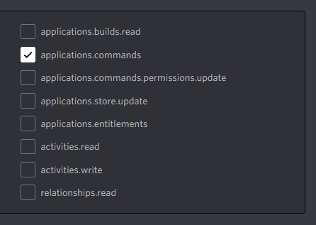

# Manually Handling Interactions

This section talks about the manual building and responding to interactions.
If you are using the interaction framework (highly recommended) this section does not apply to you.

## Bad form Exception when I try to create my commands, why do I get this?

Bad form exceptions are thrown if the slash, user or message command builder has invalid values.
The following options could resolve your error.

#### Is your command name lowercase?

If your command name is not lowercase, it is not seen as a valid command entry.
`Avatar` is invalid; `avatar` is valid.

#### Are your values below or above the required amount? (This also applies to message components)

Discord expects all values to be below maximum allowed.
Going over this maximum amount of characters causes an exception.

> [!NOTE]
> All maximum and minimum value requirements can be found in the [Discord Developer Docs].
> For components, structure documentation is found [here].

[Discord Developer Docs]: https://discord.com/developers/docs/interactions/application-commands#application-commands
[here]: https://discord.com/developers/docs/interactions/message-components#message-components

#### Is your subcommand branching correct?

Branching structure is covered properly here: xref:Guides.SlashCommands.SubCommand

## There are many options for creating commands, which do I use?

[!code-csharp[Register examples](samples/registerint.cs)]

> [!NOTE]
> You can use bulkoverwrite even if there are no commands in guild, nor globally.
> The bulkoverwrite method disposes the old set of commands and replaces it with the new.
