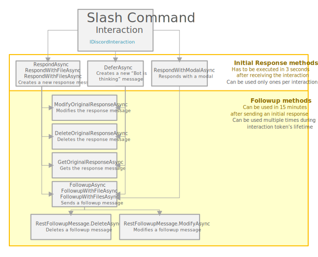
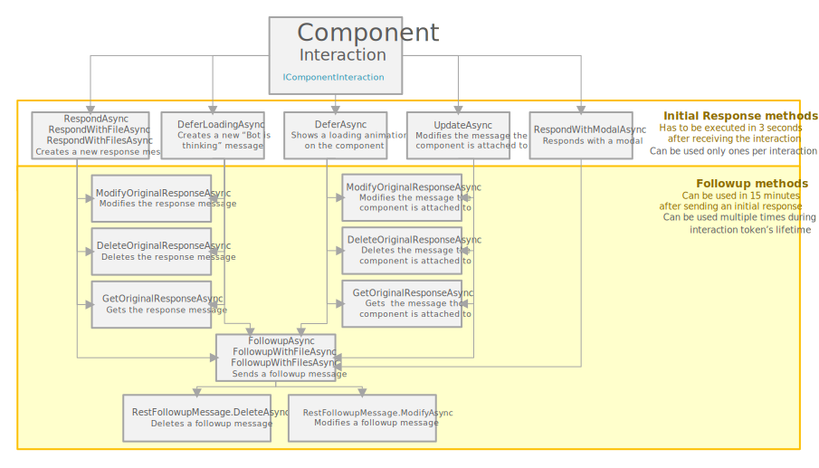
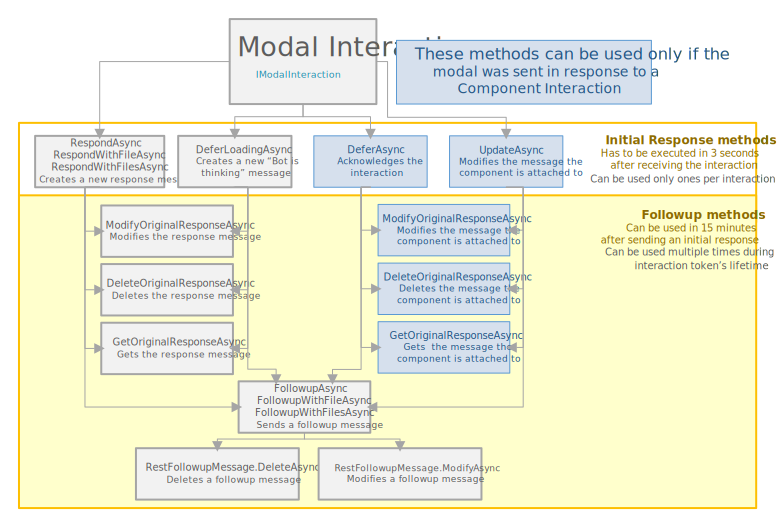

# Interaction Response Schemes

Working with interactions can appear hard and confusing - you might accidentally miss a cast or use a wrong method. These schemes should help you create efficient interaction response flows.

## Responding to a slash command interaction

Slash command interactions support the most commonly used response methods.

> [!NOTE]
> Same scheme applies to context command interactions.

## Responding to a component interaction

Component interactions share a lot of response methods with [slash command interactions](#responding-to-a-slash-command-interaction), but they also provide a way to update the message components were attached to. 

> [!NOTE]
> Some followup methods change their behavior depending on what initial response you've sent.

## Responding to a modal interaction

While being similar to [Component Interaction Scheme](#responding-to-a-modal-interaction), modal interactions lack the option of responding with a modal.

