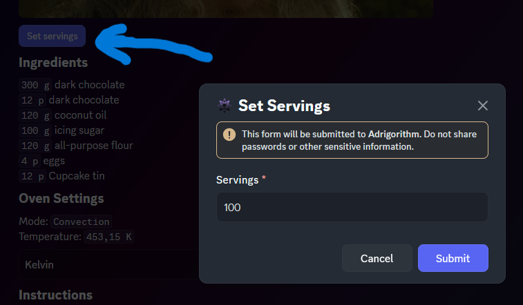
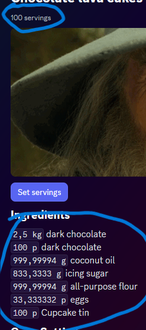
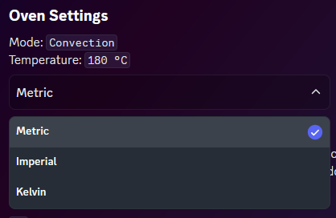

# Component types

As denoted in [Intro], This framework supports a lot of component types. This example offers some more insight into what your options are. Below is a component with `TextDisplay`, `MediaGallery` and `ActionRow` (with `Buttons` or `SelectMenu`).

## Code

Some code will not be included here as it is not relevant to this framework. If you want to see the full code, it is [here](https://github.com/Adrigorithm/Adribot/).

The main component container generation method:
[!code-csharp[ComponentBuilderV2 Sample](samples/component.cs)]

## Interactions

The button triggers the following modal

[!code-csharp[Modal Sample](samples/recipe-servings-modal.cs)]

Interactions used by this message:

[!code-csharp[Interaction Sample](samples/recipe-interactions.cs)]

After the **SET SERVINGS** modal is submitted (or the COMBOXBOX is changed) the UI is updated:

## Troubleshooting

If you run into any trouble (appliction not responding when sending components), a debugger is (like usually) a useful tool to have at your disposal. More specifically within this context: dnet will do some checks before sending the component configuration to discord, so on building the component array, you can check for errors thrown. If this does not help, setting a breakpoint on the line that sends your component to discord (ModifyAsync/RespondAsync/...) and stepping to the next line (within 3 seconds of triggering it) may yield a more specific error returned by Discord itself.

[Intro]: xref:Guides.ComponentsV2.Intro
