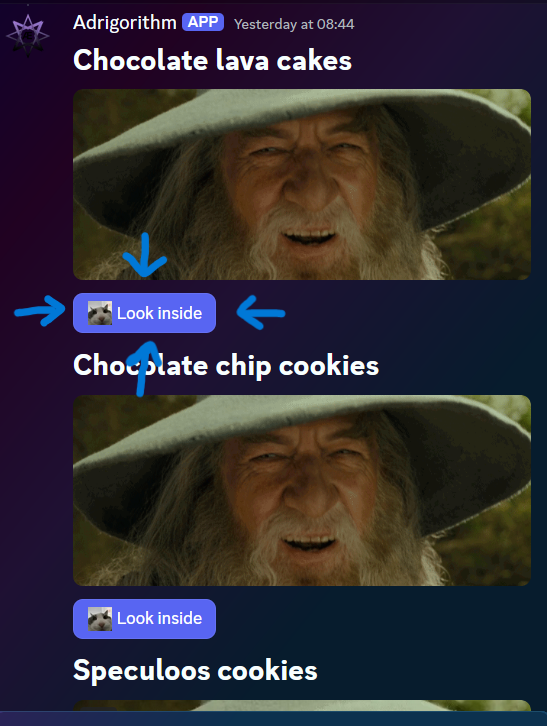
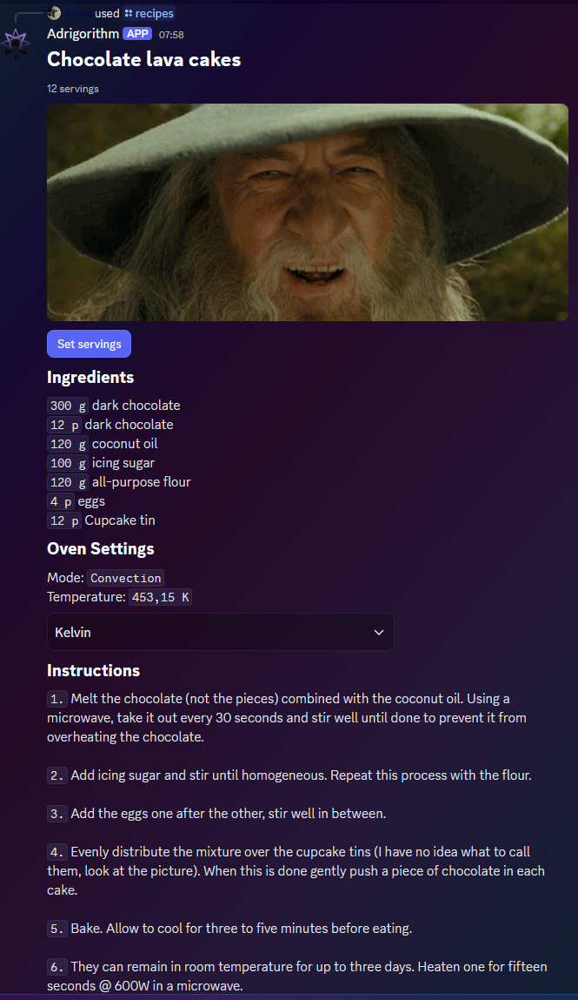

# Interaction with components

## Lifecycle
A component should receive an initial response within a 3 second timeframe. After this it can continue receiving responses for up to 15 minutes, this is useful when a component needs to be rebuilt periodically (buttons etc), which is also what we will be leveraging here.

## Catching of and responding to a user interaction

Before we respond to an interaction triggered by the user we must first "catch" it. You can do this by hooking into the `DiscordSocketClient#InteractionCreated` event. Before proceeding we should make sure that the event was triggered by our component.

Consider this component (the same as used in the intro). The buttons have a customId of "recipes-show-me-button-{recipe.RecipeId}", where the last part is an unique identifier.



```cs
private async Task ClientOnInteractionCreatedAsync(SocketInteraction arg)
{
    switch (arg)
    {
        case SocketMessageComponent component:
            switch (component.Data.CustomId)
            {
                // Non dynamic cases ...

                default:
                    var customId = component.Data.CustomId;
                    var lastPartStartIndex = customId.LastIndexOf('-');

                    if (lastPartStartIndex == -1)
                        return;

                    if (customId[..lastPartStartIndex] == RecipesLookInsideButton) // "recipes-show-me-button"
                        await component.UpdateAsync(m => m.Components = BuildComponentUnsafe(_recipes.First(r => r.RecipeId == int.Parse(customId[(lastPartStartIndex + 1)..]))).Build()); // _recipes is a list of Recipe objects ; int.Parse({recipe.RecipeId}) (in this case it is 1)

                    break;
            }

            break;
        case SocketModal modal:
            // Interaction came from a modal

            break;
        default:
            return;
    }
}
```

UpdateAsync replaces our component array with a new one built based on the button clicked (recipe with the specified ID). More on this more advanced component v2 in the **advanced** page.


