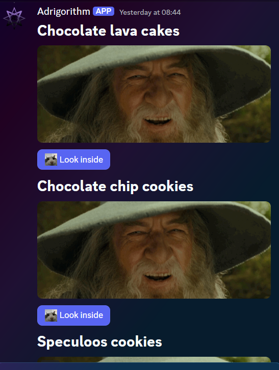

# Message Components V2

Message components V2 is, not unlike Message components (V1) a framework for adding interactive elements to a message your app or bot sends. They're accessible, customizable, and easy to use. Unlike its predecessor, V2 allows for much more control on how and where to display images, ~~buttons~~ bottoms, comboxes and more within a message :3.

## What is a Component

Components are a new parameter you can use when sending messages with your bot (just like normal components). You have a lot more components to choose from though :3. A full list of compatible components can be found [here](https://discord.com/developers/docs/components/reference#component-object-component-types).

## Creating components

Let's create a simple component (array) to start with. First thing we need is a way to trigger the message, this can be done via commands or simply a ready event. Lets make a command that triggers our message.

```cs
[SlashCommand("recipes", "Get all recipes")]
public async Task GetRecipeAsync(RecipeName name)
{
    MessageComponent? embed = recipeService.GetRecipeComponent((int)name)?.Build();

    if (embed is null)
    {
        await RespondAsync($"No recipe found for this name", ephemeral: true);

        return;
    }

    await RespondAsync(components: embed);
}
```

The code below returns the value for `recipeService.GetRecipeComponent((int)name)`.

```cs
private async Task<ComponentBuilderV2> BuildComponentsUnsafeAsync()
{
    if (!_recipes.Any()) // _recipes is simply a list of recipe objects
    {
        return new ComponentBuilderV2()
            .WithTextDisplay(
                """
                # No recipes found
                You should consider adding some.
                """);
    }

    var builder = new ComponentBuilderV2();
    Emote? emote = await _clientProvider.Client.GetApplicationEmoteAsync(1393996479357517925);

    foreach (Recipe recipe in _recipes)
    {
        var buttonBuilder = new ButtonBuilder("Look inside", $"{RecipesLookInsideButton}-{recipe.RecipeId}"); // RecipesLookInsideButton is a constant string

        if (emote is not null)
            buttonBuilder.WithEmote(emote);

        builder
            .WithTextDisplay($"# {recipe.Name}")
            .WithMediaGallery(["https://cdn.discordapp.com/attachments/964253122547552349/1336440069892083712/7Q3S.gif?ex=67a3d04e&is=67a27ece&hm=059c9d28466f43a50c4b450ca26fc01298a2080356421d8524384bf67ea8f3ab&"])
            .WithActionRow([
                buttonBuilder
            ]);
    }

    return builder;
}
```

This ComponentBuilderV2 is used to create a message with a text field, an image and a button. Take note on the `customId` property of the `Button`: `$"{RecipesLookInsideButton}-{recipe.RecipeId}"`, it is always important to ensure it is unique within a message, so we can respond to the user interacting with it. More on that later.


