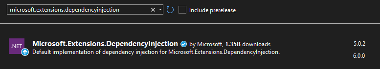

# Dependency Injection

Dependency injection is a feature not required in Discord.Net, but makes it a lot easier to use.
It can be combined with a large number of other libraries, and gives you better control over your application.

> Further into the documentation, Dependency Injection will be referred to as 'DI'.

## Installation

DI is not native to .NET. You need to install the extension packages to your project in order to use it:

- [Meta](https://www.nuget.org/packages/Microsoft.Extensions.DependencyInjection/).
- [Abstractions](https://www.nuget.org/packages/Microsoft.Extensions.DependencyInjection.Abstractions/).

> [!WARNING]
> Downloading the abstractions package alone will not give you access to required classes to use DI properly.
> Please install both packages, or choose to only install the meta package to implicitly install both.

### Visual Package Manager:

### Command Line:

`PM> Install-Package Microsoft.Extensions.DependencyInjection`.

> [!TIP]
> ASP.NET already comes packed with all the necessary assemblies in its framework.
> You do not require to install any additional NuGet packages to make full use of all features of DI in ASP.NET projects.

## Getting started

First of all, you will need to create an application based around dependency injection,
which in order will be able to access and inject them across the project.

[!code-csharp[Building the Program](samples/program.cs)]

In order to freely pass around your dependencies in different classes,
you will need to register them to a new `ServiceCollection` and build them into an `IServiceProvider` as seen above.
The IServiceProvider then needs to be accessible by the startup file, so you can access your provider and manage them.

[!code-csharp[Building the Collection](samples/collection.cs)]

As shown above, an instance of `DiscordSocketConfig` is created, and added **before** the client itself is.
Because the collection will prefer to create the highest populated constructor available with the services already present,
it will prefer the constructor with the configuration, because you already added it.

## Using your dependencies

After building your provider in the Program class constructor, the provider is now available inside the instance you're actively using.
Through the provider, we can ask for the DiscordSocketClient we registered earlier.

[!code-csharp[Applying DI in RunAsync](samples/runasync.cs)]

> [!WARNING]
> Service constructors are not activated until the service is **first requested**.
> An 'endpoint' service will have to be requested from the provider before it is activated.
> If a service is requested with dependencies, its dependencies (if not already active) will be activated before the service itself is.

## Injecting dependencies

You can not only directly access the provider from a field or property, but you can also pass around instances to classes registered in the provider.
There are multiple ways to do this. Please refer to the
[Injection Documentation](xref:Guides.DI.Injection) for further information.
