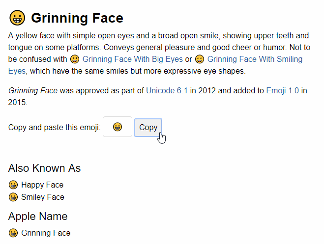
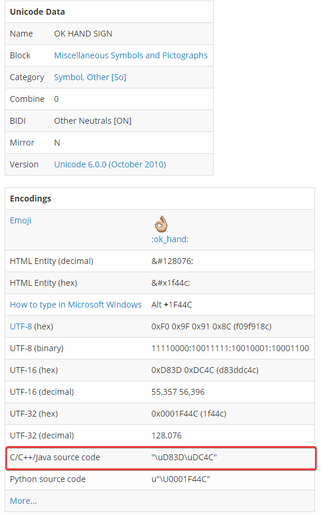
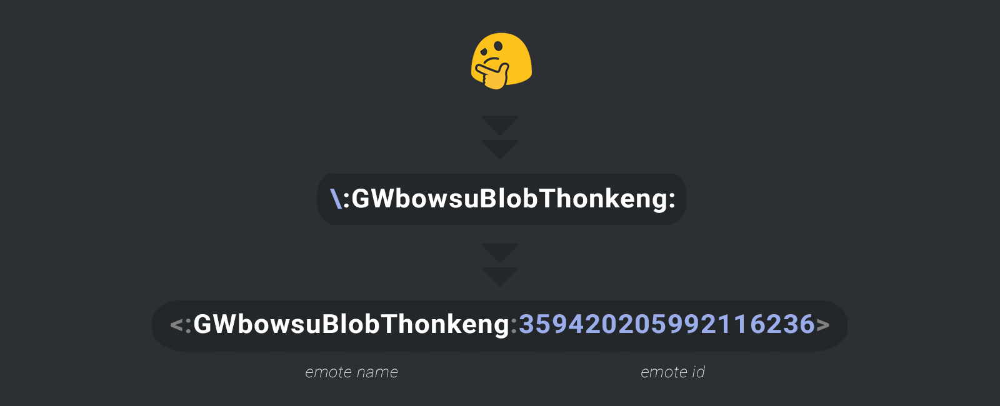

# Emoji in Discord.Net

Before we delve into the difference between an @Discord.Emoji and an
@Discord.Emote in Discord.Net, it is **crucial** to understand what
they both look like behind the scene. When the end-users are sending
or receiving an emoji or emote, they are typically in the form of
`:ok_hand:` or `:reeee:`; however, what goes under the hood is that,
depending on the type of emoji, they are sent in an entirely
different format.

What does this all mean? It means that you should know that by
reacting with a string like `“:ok_hand:”` will **NOT** automatically
translate to `👌`; rather, it will be treated as-is,
like `:ok_hand:`, thus the server will return a `400 Bad Request`.

## Emoji

An emoji is a standard emoji that can be found anywhere else outside
of Discord, which means strings like `👌`, `♥`, `👀` are all
considered an emoji in Discord. However, from the
introduction paragraph we have learned that we cannot
simply send `:ok_hand:` and have Discord take
care of it, but what do we need to send exactly?

To send an emoji correctly, one must send the emoji in its Unicode
form; this can be obtained in several different ways.

1. (Easiest) Escape the emoji by using the escape character, `\`, in
 your Discord chat client; this will reveal the emoji’s pure Unicode
 form, which will allow you to copy-paste into your code.
2. Look it up on Emojipedia, from which you can copy the emoji
 easily into your code.
 
3. (Recommended) Look it up in the Emoji list from [FileFormat.Info];
 this will give you the .NET-compatible code that
 represents the emoji.
    * This is the most recommended method because some systems or
    IDE sometimes do not render the Unicode emoji correctly.
    

### Emoji Declaration

After obtaining the Unicode representation of the emoji, you may
create the @Discord.Emoji object by passing the string into its
constructor (e.g. `new Emoji("👌");` or `new Emoji("\uD83D\uDC4C");`).

Your method of declaring an @Discord.Emoji should look similar to
this:

[!code-csharp[Emoji Sample](samples/emoji-sample.cs)]

[FileFormat.Info]: https://www.fileformat.info/info/emoji/list.htm

## Emote

The meat of the debate is here; what is an emote and how does it
differ from an emoji? An emote refers to a **custom emoji**
created on Discord.

The underlying structure of an emote also differs drastically; an
emote looks sort-of like a mention on Discord. It consists of two
main elements as illustrated below:

As you can see, emote uses a completely different format. To obtain
the raw string as shown above for your emote, you would need to
escape the emote using the escape character `\` in chat somewhere.

### Emote Declaration

After obtaining the raw emote string, you would need to use
@Discord.Emote.Parse* or @Discord.Emote.TryParse* to create a valid
emote object.

Your method of declaring an @Discord.Emote should look similar to
this:

[!code[Emote Sample](samples/emote-sample.cs)]

> [!TIP]
> For WebSocket users, you may also consider fetching the Emote
> via the @Discord.WebSocket.SocketGuild.Emotes collection.
> [!code-csharp[Socket emote sample](samples/socket-emote-sample.cs)]

> [!TIP]
> On Discord, any user with Discord Nitro subscription may use
> custom emotes from any guilds they are currently in. This is also
> true for _any_ standard bot accounts; this does not require
> the bot owner to have a Nitro subscription.

## Additional Information

To learn more about emote and emojis and how they could be used,
see the documentation of @Discord.IEmote.