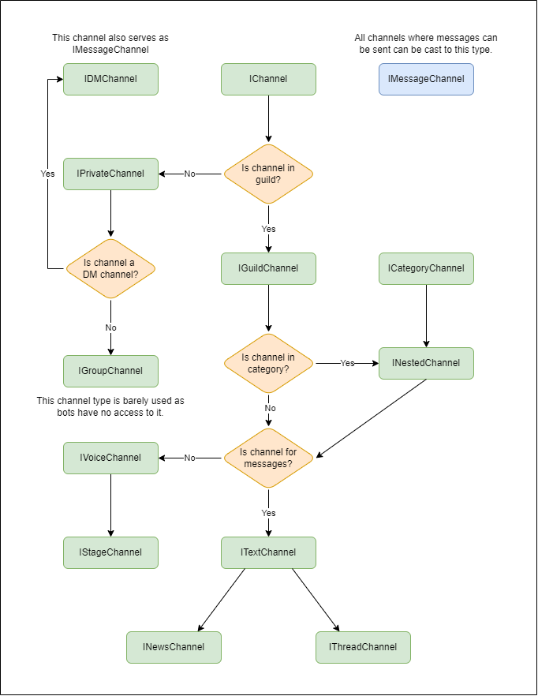
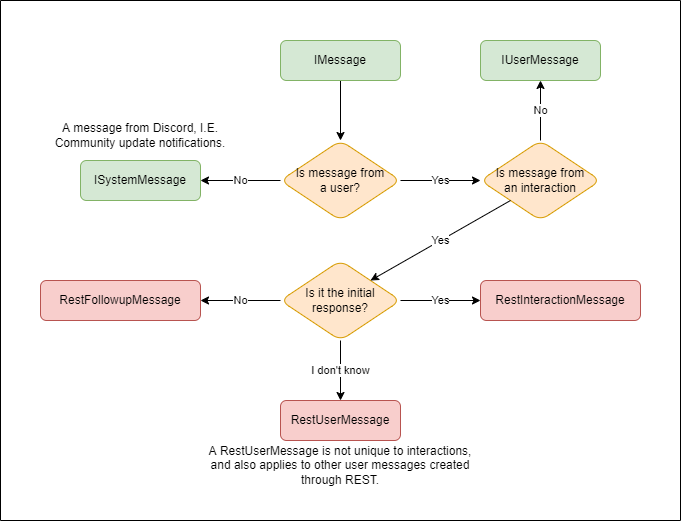
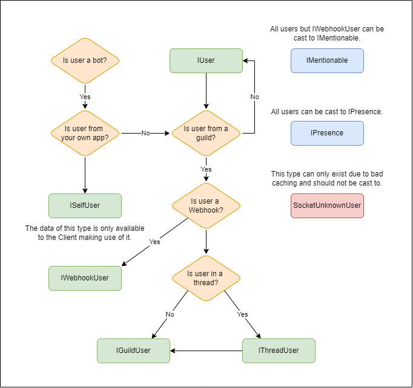
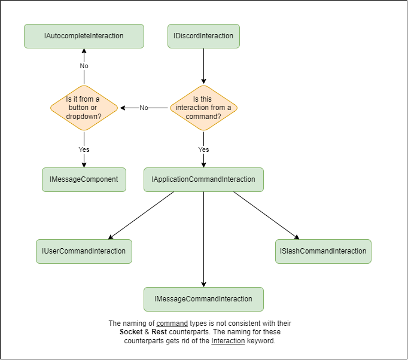

# Entity Types

A list of all Discord.Net entities, what they can be cast to and what their properties are.

> [!NOTE]
> All interfaces have the same inheritance tree for both `Socket` and `Rest` entities.
> Entities with that have been marked red are exclusive to the project they source from.

## Channels

### Message Channels
* A **Text Channel** ([ITextChannel]) is a message channel from a Guild.
* A **Thread Channel** ([IThreadChannel]) is a thread channel from a Guild.
* A **News Channel** ([INewsChannel]) (also goes as announcement channel) is a news channel from a Guild.
* A **DM Channel** ([IDMChannel]) is a message channel from a DM.
* A **Group Channel** ([IGroupChannel]) is a message channel from a Group.
	- This is rarely used due to the bot's inability to join groups.
* A **Private Channel** ([IPrivateChannel]) is a DM or a Group.
* A **Message Channel** ([IMessageChannel]) can be any of the above.

### Misc Channels
* A **Guild Channel** ([IGuildChannel]) is a guild channel in a guild.
	- This can be any channels that may exist in a guild.
* A **Voice Channel** ([IVoiceChannel]) is a voice channel in a guild.
* A **Stage Channel** ([IStageChannel]) is a stage channel in a guild.
* A **Category Channel** ([ICategoryChannel]) is a category that
holds one or more sub-channels.
* A **Nested Channel** ([INestedChannel]) is a channel that can
exist under a category.

[INestedChannel]: xref:Discord.INestedChannel
[IGuildChannel]: xref:Discord.IGuildChannel
[IMessageChannel]: xref:Discord.IMessageChannel
[ITextChannel]: xref:Discord.ITextChannel
[IGroupChannel]: xref:Discord.IGroupChannel
[IDMChannel]: xref:Discord.IDMChannel
[IPrivateChannel]: xref:Discord.IPrivateChannel
[IVoiceChannel]: xref:Discord.IVoiceChannel
[ICategoryChannel]: xref:Discord.ICategoryChannel
[IChannel]: xref:Discord.IChannel
[IThreadChannel]: xref:Discord.IThreadChannel
[IStageChannel]: xref:Discord.IStageChannel
[INewsChannel]: xref:Discord.INewsChannel

## Messages

* A **Rest Followup Message** ([RestFollowupMessage]) is a message returned by followup on on an interaction.
* A **Rest Interaction Message** ([RestInteractionMessage]) is a message returned by the interaction's original response.
* A **Rest User Message** ([RestUserMessage]) is a message sent over rest; it can be any of the above.
* An **User Message** ([IUserMessage]) is a message sent by a user.
* A **System Message** ([ISystemMessage]) is a message sent by Discord itself.
* A **Message** ([IMessage]) can be any of the above.

[RestFollowupMessage]: xref:Discord.Rest.RestFollowupMessage
[RestInteractionMessage]: xref:Discord.Rest.RestInteractionMessage
[RestUserMEssage]: xref:Discord.Rest.RestUserMessage
[IUserMessage]: xref:Discord.IUserMessage
[ISystemMessage]: xref:Discord.ISystemMessage
[IMessage]: xref:Discord.IMessage

## Users

* A **Guild User** ([IGuildUser]) is a user available inside a guild.
* A **Group User** ([IGroupUser]) is a user available inside a group.
	- This is rarely used due to the bot's inability to join groups.
* A **Self User** ([ISelfUser]) is the bot user the client is currently logged in as.
* An **User** ([IUser]) can be any of the above.

[IGuildUser]: xref:Discord.IGuildUser
[IGroupUser]: xref:Discord.IGroupUser
[ISelfUser]: xref:Discord.ISelfUser
[IUser]: xref:Discord.IUser

## Interactions

* A **Slash command** ([ISlashCommandInteraction]) is an application command executed in the text box, with provided parameters.
* A **Message Command** ([IMessageCommandInteraction]) is an application command targeting a message.
* An **User Command** ([IUserCommandInteraction]) is an application command targeting a user.
* An **Application Command** ([IApplicationCommandInteraction]) is any of the above.
* A **Message component** ([IMessageComponent]) is the interaction of a button being clicked/dropdown option(s) entered.
* An **Autocomplete Interaction** ([IAutocompleteinteraction]) is an interaction that has been automatically completed.
* An **Interaction** ([IDiscordInteraction]) is any of the above.

[ISlashCommandInteraction]: xref:Discord.ISlashCommandInteraction
[IMessageCommandInteraction]: xref:Discord.IMessageCommandInteraction
[IUserCommandInteraction]: xref:Discord.IUserCommandInteraction
[IApplicationCommandInteraction]: xref:Discord.IApplicationCommandInteraction
[IMessageComponent]: xref:Discord.IMessageComponent
[IAutocompleteinteraction]: xref:Discord.IAutocompleteInteraction
[IDiscordInteraction]: xref:Discord.IDiscordInteraction

## Other types:

### Emoji

* An **Emote** ([Emote]) is a custom emote from a guild.
	- Example: `<:dotnet:232902710280716288>`
* An **Emoji** ([Emoji]) is a Unicode emoji.
	- Example: `👍`

[Emote]: xref:Discord.Emote
[Emoji]: xref:Discord.Emoji

### Stickers

* A **Sticker** ([ISticker]) is a standard Discord sticker.
* A **Custom Sticker** ([ICustomSticker]) is a Guild-unique sticker.

[ISticker]: xref:Discord.ISticker
[ICustomSticker]: xref:Discord.ICustomSticker

### Activity

* A **Game** ([Game]) refers to a user's game activity.
* A **Rich Presence** ([RichGame]) refers to a user's detailed
gameplay status.
	- Visit [Rich Presence Intro] on Discord docs for more info.
* A **Streaming Status** ([StreamingGame]) refers to user's activity
for streaming on services such as Twitch.
* A **Spotify Status** ([SpotifyGame]) (2.0+) refers to a user's
activity for listening to a song on Spotify.

[Game]: xref:Discord.Game
[RichGame]: xref:Discord.RichGame
[StreamingGame]: xref:Discord.StreamingGame
[SpotifyGame]: xref:Discord.SpotifyGame
[Rich Presence Intro]: https://discord.com/developers/docs/rich-presence/best-practices
