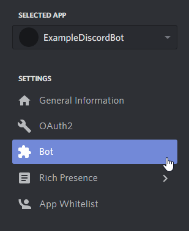
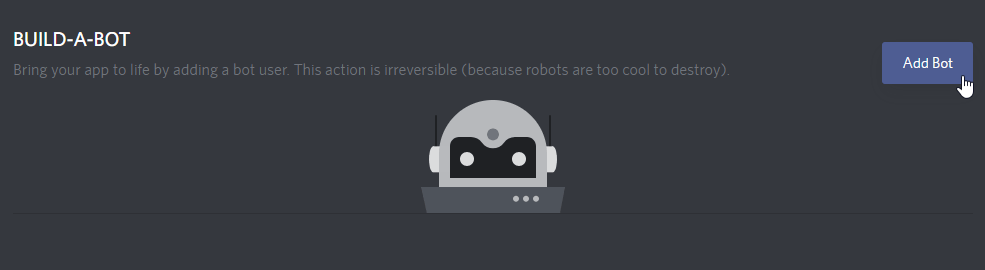
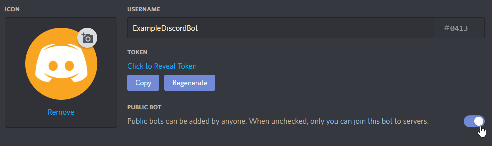
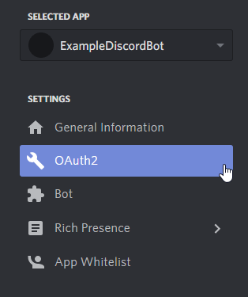
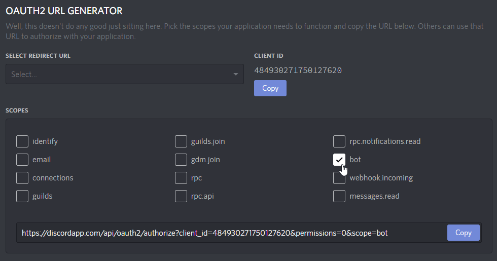
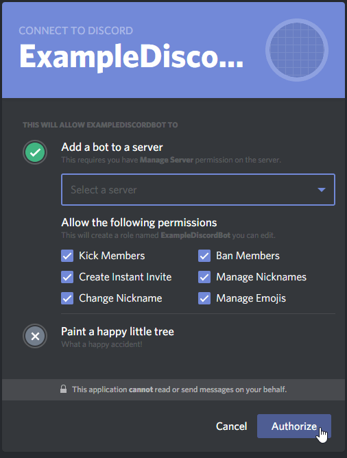
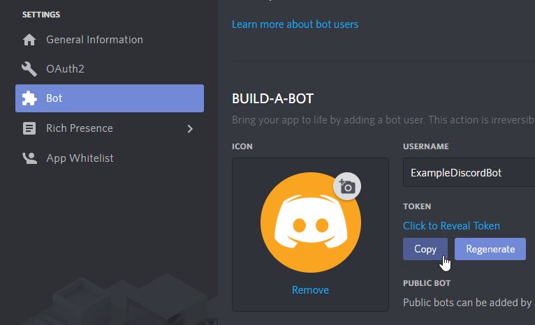

# Making Your First Bot with Discord.Net

One of the ways to get started with the Discord API is to write a
basic ping-pong bot. This bot will respond to a simple command "ping."
We will expand on this to create more diverse commands later, but for
now, it is a good starting point.

## Creating a Discord Bot

Before writing your bot, it is necessary to create a bot account via
the Discord Applications Portal first.

1. Visit the [Discord Applications Portal].
2. Create a new application.
3. Give the application a name (this will be the bot's initial username).
4. On the left-hand side, under `Settings`, click `Bot`.

    

5. Click on `Add Bot`.

    

6. Confirm the popup.
7. (Optional) If this bot will be public, tick `Public Bot`.

    

[Discord Applications Portal]: https://discordapp.com/developers/applications/

## Adding your bot to a server

Bots **cannot** use invite links; they must be explicitly invited
through the OAuth2 flow.

1. Open your bot's application on the [Discord Applications Portal].
2. On the left-hand side, under `Settings`, click `OAuth2`.

    

3. Scroll down to `OAuth2 URL Generator` and under `Scopes` tick `bot`.

    

4. Scroll down further to `Bot Permissions` and select the
 permissions that you wish to assign your bot with.

    > [!NOTE]
    > This will assign the bot with a special "managed" role that no
    > one else can use. The permissions can be changed later in the
    > roles settings if you ever change your mind!

5. Open the generated authorization URL in your browser.
6. Select a server.
7. Click on Authorize.

    > [!NOTE]
    > Only servers where you have the `MANAGE_SERVER` permission will be
    > present in this list.

    

## Connecting to Discord

If you have not already created a project and installed Discord.Net,
do that now.

For more information, see @Guides.GettingStarted.Installation.

### Async

Discord.Net uses .NET's [Task-based Asynchronous Pattern (TAP)]
extensively - nearly every operation is asynchronous. It is highly
recommended for these operations to be awaited in a
properly established async context whenever possible.

To establish an async context, we will be creating an async main method
in your console application, and rewriting the static main method to
invoke the new async main.

[!code-csharp[Async Context](samples/first-bot/async-context.cs)]

As a result of this, your program will now start and immediately
jump into an async context. This allows us to create a connection
to Discord later on without having to worry about setting up the
correct async implementation.

> [!WARNING]
> If your application throws any exceptions within an async context,
> they will be thrown all the way back up to the first non-async method;
> since our first non-async method is the program's `Main` method, this
> means that **all** unhandled exceptions will be thrown up there, which
> will crash your application.
>
> Discord.Net will prevent exceptions in event handlers from crashing
> your program, but any exceptions in your async main **will** cause
> the application to crash.

[Task-based Asynchronous Pattern (TAP)]: https://docs.microsoft.com/en-us/dotnet/articles/csharp/async

### Creating a logging method

Before we create and configure a Discord client, we will add a method
to handle Discord.Net's log events.

To allow agnostic support of as many log providers as possible, we
log information through a `Log` event with a proprietary `LogMessage`
parameter. See the [API Documentation] for this event.

If you are using your own logging framework, this is where you would
invoke it. For the sake of simplicity, we will only be logging to
the console.

You may learn more about this concept in @Guides.Concepts.Logging.

[!code-csharp[Async Context](samples/first-bot/logging.cs)]

[API Documentation]: xref:Discord.Rest.BaseDiscordClient.Log

### Creating a Discord Client

Finally, we can create a new connection to Discord.

Since we are writing a bot, we will be using a [DiscordSocketClient]
along with socket entities. See @Guides.GettingStarted.Terminology
if you are unsure of the differences.

To establish a new connection, we will create an instance of
[DiscordSocketClient] in the new async main. You may pass in an
optional @Discord.WebSocket.DiscordSocketConfig if necessary. For most
users, the default will work fine.

Before connecting, we should hook the client's `Log` event to the
log handler that we had just created. Events in Discord.Net work
similarly to any other events in C#.

Next, you will need to "log in to Discord" with the [LoginAsync]
method with the application's "token."

> [!NOTE]
> Pay attention to what you are copying from the developer portal!
> A token is not the same as the application's "client secret."

> [!IMPORTANT]
> Your bot's token can be used to gain total access to your bot, so
> **do __NOT__ share this token with anyone else!** It may behoove you
> to store this token in an external source if you plan on distributing
> the source code for your bot.

We may now invoke the client's [StartAsync] method, which will
start connection/reconnection logic. It is important to note that
**this method will return as soon as connection logic has been started!**

Any methods that rely on the client's state should go in an event
handler. This means that you should **not** directly be interacting with
the client before it is fully ready.

Finally, we will want to block the async main method from returning
when running the application. To do this, we can await an infinite delay
or any other blocking method, such as reading from the console.

The following lines can now be added:

[!code-csharp[Create client](samples/first-bot/client.cs)]

At this point, feel free to start your program and see your bot come
online in Discord.

> [!TIP]
> Getting a warning about `A supplied token was invalid.` and/or
> having trouble logging in? Double-check whether you have put in
> the correct credentials and make sure that it is _not_ a client
> secret, which is different from a token.

> [!TIP]
> Encountering a `PlatformNotSupportedException` when starting your bot?
> This means that you are targeting a platform where .NET's default
> WebSocket client is not supported. Refer to the [installation guide]
> for how to fix this.

[DiscordSocketClient]: xref:Discord.WebSocket.DiscordSocketClient
[LoginAsync]: xref:Discord.Rest.BaseDiscordClient.LoginAsync*
[StartAsync]: xref:Discord.WebSocket.DiscordSocketClient.StartAsync*
[installation guide]: xref:Guides.GettingStarted.Installation

### Handling a 'ping'

> [!WARNING]
> Please note that this is *not* a proper way to create a command.
> Use the `CommandService` provided by the library instead, as explained
> in the [Command Guide](xref:Guides.Commands.Intro) section.

Now that we have learned to open a connection to Discord, we can
begin handling messages that the users are sending. To start out, our
bot will listen for any message whose content is equal to `!ping` and
will respond back with "Pong!".

Since we want to listen for new messages, the event to hook into
is [MessageReceived].

In your program, add a method that matches the signature of the
`MessageReceived` event - it must be a method (`Func`) that returns
the type `Task` and takes a single parameter, a [SocketMessage]. Also,
since we will be sending data to Discord in this method, we will flag
it as `async`.

In this method, we will add an `if` block to determine if the message
content fits the rules of our scenario - recall that it must be equal
to `!ping`.

Inside the branch of this condition, we will want to send a message,
`Pong!`, back to the channel from which the message comes from. To
find the channel, look for the `Channel` property on the message
parameter.

Next, we will want to send a message to this channel. Since the
channel object is of type [ISocketMessageChannel], we can invoke the
[SendMessageAsync] instance method. For the message content, send back
a string, "Pong!".

You should have now added the following lines,

[!code-csharp[Message](samples/first-bot/message.cs)]

Now that your first bot is complete. You may continue to add on to this
if you desire, but for any bots that will be carrying out multiple
commands, it is strongly recommended to use the command framework as
shown below.

> [!NOTE]
> For your reference, you may view the [completed program].

[MessageReceived]: xref:Discord.WebSocket.BaseSocketClient.MessageReceived
[SocketMessage]: xref:Discord.WebSocket.SocketMessage
[ISocketMessageChannel]: xref:Discord.WebSocket.ISocketMessageChannel
[SendMessageAsync]: xref:Discord.WebSocket.ISocketMessageChannel.SendMessageAsync*
[completed program]: samples/first-bot/complete.cs

# Building a bot with commands

@Guides.Commands.Intro will guide you through how to setup a program
that is ready for [CommandService], a service that is ready for
advanced command usage.

For reference, view an [annotated example] of this structure.

[annotated example]: samples/first-bot/structure.cs

It is important to know that the recommended design pattern of bots
should be to separate...

1. the program (initialization and command handler)
2. the modules (handle commands)
3. the services (persistent storage, pure functions, data manipulation)

[CommandService]: xref:Discord.Commands.CommandService