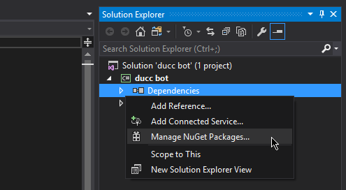
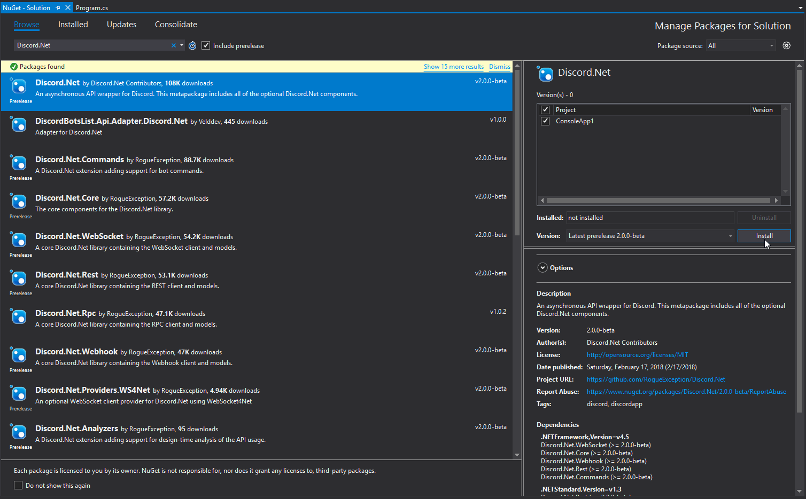
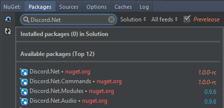
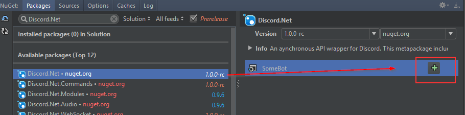

# Discord.Net Installation

Discord.Net is distributed through the NuGet package manager; the most
recommended way for you to install this library. Alternatively, you
may also compile this library yourself should you so desire.

## Supported Platforms

Discord.Net targets [.NET Standard] both 1.3 and 2.0; this also means
that creating applications using the latest version of [.NET Core] is
the most recommended. If you are bound by Windows-specific APIs or
other limitations, you may also consider targeting [.NET Framework]
4.6.1 or higher.

> [!WARNING]
> Using this library with [Mono] is not supported until further
> notice. It is known to have issues with the library's WebSockets
> implementation and may crash the application upon startup.

[Mono]: https://www.mono-project.com/
[.NET Standard]: https://docs.microsoft.com/en-us/dotnet/articles/standard/library
[.NET Core]: https://docs.microsoft.com/en-us/dotnet/articles/core/
[.NET Framework]: https://docs.microsoft.com/en-us/dotnet/framework/get-started/
[additional steps]: #installing-on-net-standard-11

## Installing with NuGet

Release builds of Discord.Net will be published to the
[official NuGet feed].

Development builds of Discord.Net, as well as add-ons, will be
published to our [MyGet feed]. See
@Guides.GettingStarted.Installation.Nightlies to learn more.

[official NuGet feed]: https://nuget.org
[MyGet feed]: https://www.myget.org/feed/Packages/discord-net

### [Using Visual Studio](#tab/vs-install)

1. Create a new solution for your bot
2. In the Solution Explorer, find the "Dependencies" element under your
 bot's project
3. Right click on "Dependencies", and select "Manage NuGet packages"

    

4. In the "Browse" tab, search for `Discord.Net`
5. Install the `Discord.Net` package

    

### [Using JetBrains Rider](#tab/rider-install)

1. Create a new solution for your bot
2. Open the NuGet window (Tools > NuGet > Manage NuGet packages for Solution)

    

3. In the "Packages" tab, search for `Discord.Net`

    

4. Install by adding the package to your project

    

### [Using Visual Studio Code](#tab/vs-code)

1. Create a new project for your bot
2. Add `Discord.Net` to your `*.csproj`

[!code[Sample .csproj](samples/project.xml)]

### [Using dotnet CLI](#tab/dotnet-cli)

1. Launch a terminal of your choice
2. Navigate to where your `*.csproj` is located
3. Enter `dotnet add package Discord.Net`

***

## Compiling from Source

In order to compile Discord.Net, you will need the following:

### Using Visual Studio

* [Visual Studio 2019](https://visualstudio.microsoft.com/)
* [.NET Core SDK]

The .NET Core and Docker workload is required during Visual Studio
installation.

### Using Command Line

* [.NET Core SDK]

## Additional Information

### Installing on Unsupported WebSocket Platform

When running any Discord.Net-powered bot on an older operating system
(e.g. Windows 7) that does not natively support WebSocket,
you may encounter a @System.PlatformNotSupportedException upon
connecting.

You may resolve this by either targeting .NET Core 2.1 or higher, or
by installing one or more custom packages as listed below.

#### [Targeting .NET Core 2.1](#tab/core2-1)

1. Download the latest [.NET Core SDK].
2. Create or move your existing project to use .NET Core.
3. Modify your `<TargetFramework>` tag to at least `netcoreapp2.1`, or
 by adding the `--framework netcoreapp2.1` switch when building.

#### [Custom Packages](#tab/custom-pkg)

1. Install or compile the following packages:

    * `Discord.Net.Providers.WS4Net`
    * `Discord.Net.Providers.UDPClient` (Optional)
        * This is _only_ required if your bot will be utilizing voice chat.

2. Configure your [DiscordSocketClient] to use these custom providers
over the default ones.

    * To do this, set the `WebSocketProvider` and the optional 
    `UdpSocketProvider` properties on the [DiscordSocketConfig] that you
    are passing into your client.

[!code-csharp[Example](samples/netstd11.cs)]

[DiscordSocketClient]: xref:Discord.WebSocket.DiscordSocketClient
[DiscordSocketConfig]: xref:Discord.WebSocket.DiscordSocketConfig

***

[.NET Core SDK]: https://dotnet.microsoft.com/download