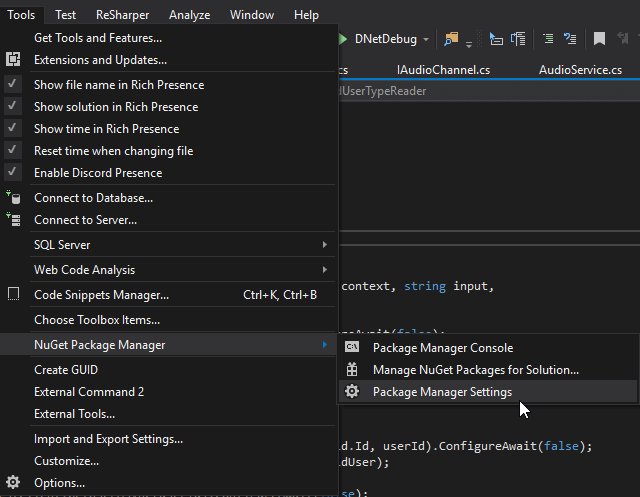
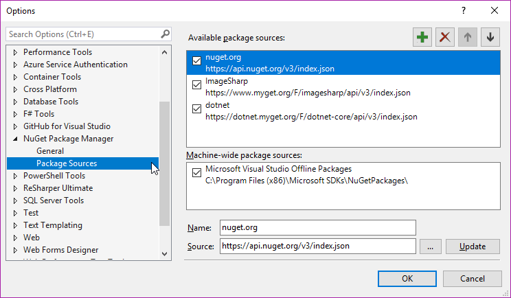
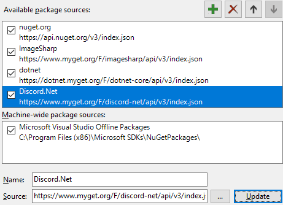
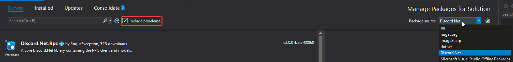
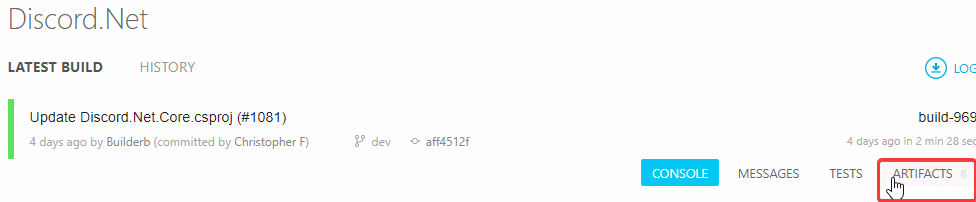
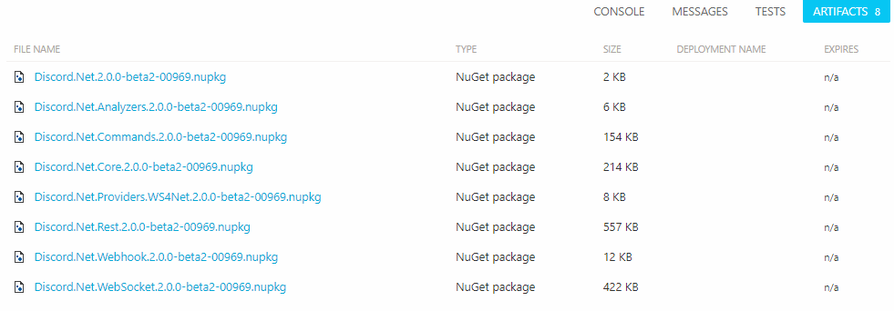

# Installing Discord.Net Nightly Build

Before Discord.Net pushes a new set of features into the stable
version, we use nightly builds to test the features with the
community for an extensive period of time. Each nightly build is
compiled by AppVeyor whenever a new commit is made and will be pushed
to our MyGet feed.

> [!IMPORTANT]
> Before beginning, it is important to note that although nightlies
> are generally stable and have more features and bug fixes than
> the current stable build on NuGet, there **will** be breaking
> changes during the development or breaking bugs. Although breaking
> bugs are usually fixed as soon as they are discovered. It is still
> important to keep this in mind.

## Installing with MyGet (Recommended)

MyGet is typically used by many development teams to publish their
latest pre-release packages before the features are finalized and
pushed to NuGet.

The following is the feed link of Discord.Net,

* `https://www.myget.org/F/discord-net/api/v3/index.json`

Depending on which IDE you use, there are many different ways of
adding the feed to your package source.

### [Visual Studio](#tab/vs)

1. Go to `Tools` > `NuGet Package Manager` > `Package Manager Settings`
    
2. Go to `Package Sources`
    
3. Click on the add icon
4. Fill in the desired name and source as shown below and hit `Update`
    

> [!NOTE]
> Remember to tick the `Include prerelease` checkbox to see the
> nightly builds!
> 

### [Local NuGet.Config](#tab/local-nuget-config)

If you plan on deploying your bot or developing outside of Visual
Studio, you will need to create a local NuGet configuration file for
your project.

To do this, create a file named `NuGet.Config` alongside the root of
your application, where the project is located.

Paste the following snippets into this configuration file, adding any
additional feeds if necessary.

[!code[NuGet Configuration](samples/nuget.config)]

After which, you may install the packages by directly modifying the
project file, using the dotnet CLI (`dotnet add package Discord.Net`),
or by using PowerShell (`Install-Package Discord.Net -Prerelease`).

***

## Installing from AppVeyor Artifacts

As mentioned in the first paragraph, we utilize AppVeyor to perform
automated test and build publishing. During the publishing process,
we also upload the NuGet packages onto AppVeyor's Artifact collection.

The latest build status can be found within our [AppVeyor project].

[AppVeyor project]: https://ci.appveyor.com/project/rogueexception/discord-net

1. In the project, you may find our latest build including the
 aforementioned artifacts.
    
2. In the artifacts collection, you should see the latest packages
 packed in `*.nupkg` form which you could download from and use.
    
