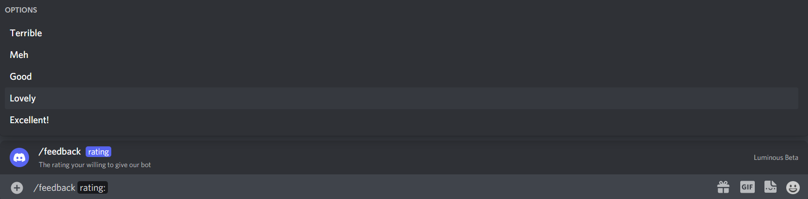
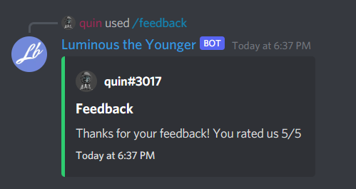

# Slash Command Choices.

With slash command options you can add choices, making the user select between some set values. Lets create a command that asks how much they like our bot!

Let's set up our slash command:

```cs
private async Task Client_Ready()
{
    ulong guildId = 848176216011046962;

    var guildCommand = new SlashCommandBuilder()
        .WithName("feedback")
        .WithDescription("Tell us how much you are enjoying this bot!")
        .AddOption(new SlashCommandOptionBuilder()
            .WithName("rating")
            .WithDescription("The rating your willing to give our bot")
            .WithRequired(true)
            .AddChoice("Terrible", 1)
            .AddChoice("Meh", 2)
            .AddChoice("Good", 3)
            .AddChoice("Lovely", 4)
            .AddChoice("Excellent!", 5)
            .WithType(ApplicationCommandOptionType.Integer)
        );

    try
    {
        await client.Rest.CreateGuildCommand(guildCommand.Build(), guildId);
    }
    catch(ApplicationCommandException exception)
    {
        var json = JsonConvert.SerializeObject(exception.Error, Formatting.Indented);
        Console.WriteLine(json);
    }
}
```
> [!NOTE]
>  Your `ApplicationCommandOptionType` specifies which type your choices are, you need to use `ApplicationCommandOptionType.Integer` for choices whos values are whole numbers, `ApplicationCommandOptionType.Number` for choices whos values are doubles, and `ApplicationCommandOptionType.String` for string values.

We have defined 5 choices for the user to pick from, each choice has a value assigned to it. The value can either be a string or an int. In our case we're going to use an int. This is what the command looks like:



Lets add our code for handling the interaction.

```cs
private async Task SlashCommandHandler(SocketSlashCommand command)
{
    // Let's add a switch statement for the command name so we can handle multiple commands in one event.
    switch(command.Data.Name)
    {
        case "list-roles":
            await HandleListRoleCommand(command);
            break;
        case "settings":
            await HandleSettingsCommand(command);
            break;
        case "feedback":
            await HandleFeedbackCommand(command);
            break;
    }
}

private async Task HandleFeedbackCommand(SocketSlashCommand command)
{
    var embedBuilder = new EmbedBuilder()
        .WithAuthor(command.User)
        .WithTitle("Feedback")
        .WithDescription($"Thanks for your feedback! You rated us {command.Data.Options.First().Value}/5")
        .WithColor(Color.Green)
        .WithCurrentTimestamp();

    await command.RespondAsync(embed: embedBuilder.Build());
}
```

And this is the result:


