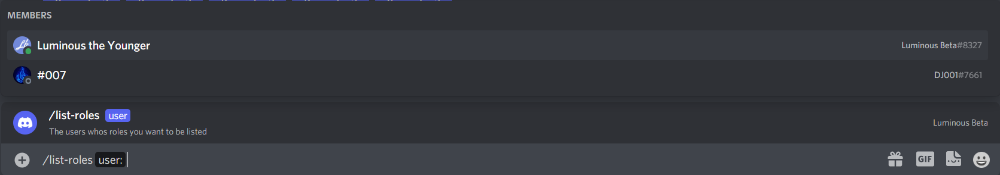
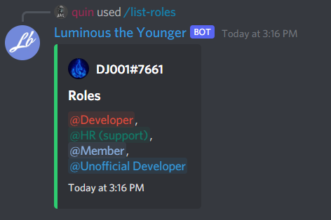

# Slash command parameters

Slash commands can have a bunch of parameters, each their own type. Let's first go over the types of parameters we can have.

| Name            | Description                                        |
| --------------- | -------------------------------------------------- |
| SubCommand      | A subcommand inside of a subcommand group.         |
| SubCommandGroup | The parent command group of subcommands.           |
| String          | A string of text.                                  |
| Integer         | A number.                                          |
| Boolean         | True or False.                                     |
| User            | A user                                             |
| Role            | A role.                                            |
| Channel         | A channel, this includes voice text and categories |
| Mentionable     | A role or a user.                                  |
| File            | A file                                             |

Each one of the parameter types has its own DNET type in the `SocketSlashCommandDataOption`'s Value field:
| Name | C# Type |
| --------------- | ------------------------------------------------ |
| SubCommand | NA |
| SubCommandGroup | NA |
| String | `string` |
| Integer | `int` |
| Boolean | `bool` |
| User | `SocketGuildUser` or `SocketUser` |
| Role | `SocketRole` |
| Channel | `SocketChannel` |
| Mentionable | `SocketUser`, `SocketGuildUser`, or `SocketRole` |
| File | `IAttachment` |

Let's start by making a command that takes in a user and lists their roles.

```cs
client.Ready += Client_Ready;

...

public async Task Client_Ready()
{
    ulong guildId = 848176216011046962;

    var guildCommand = new Discord.SlashCommandBuilder()
        .WithName("list-roles")
        .WithDescription("Lists all roles of a user.")
        .AddOption("user", ApplicationCommandOptionType.User, "The users whos roles you want to be listed", isRequired: true);

    try
    {
        await client.Rest.CreateGuildCommand(guildCommand.Build(), guildId);
    }
    catch(ApplicationCommandException exception)
    {
        var json = JsonConvert.SerializeObject(exception.Error, Formatting.Indented);
        Console.WriteLine(json);
    }
}

```



That seems to be working, now Let's handle the interaction.

```cs
private async Task SlashCommandHandler(SocketSlashCommand command)
{
    // Let's add a switch statement for the command name so we can handle multiple commands in one event.
    switch(command.Data.Name)
    {
        case "list-roles":
            await HandleListRoleCommand(command);
            break;
    }
}

private async Task HandleListRoleCommand(SocketSlashCommand command)
{
    // We need to extract the user parameter from the command. since we only have one option and it's required, we can just use the first option.
    var guildUser = (SocketGuildUser)command.Data.Options.First().Value;

    // We remove the everyone role and select the mention of each role.
    var roleList = string.Join(",\n", guildUser.Roles.Where(x => !x.IsEveryone).Select(x => x.Mention));

    var embedBuiler = new EmbedBuilder()
        .WithAuthor(guildUser.ToString(), guildUser.GetAvatarUrl() ?? guildUser.GetDefaultAvatarUrl())
        .WithTitle("Roles")
        .WithDescription(roleList)
        .WithColor(Color.Green)
        .WithCurrentTimestamp();

    // Now, Let's respond with the embed.
    await command.RespondAsync(embed: embedBuiler.Build());
}
```



That has worked! Next, we will go over responding ephemerally.
