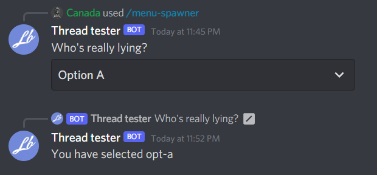

# Select menus

Select menus allow users to select from a range of options, this can be quite useful with configuration commands etc.

## Creating a select menu

We can use a `SelectMenuBuilder` to create our menu.

```cs
var menuBuilder = new SelectMenuBuilder()
    .WithPlaceholder("Select an option")
    .WithCustomId("menu-1")
    .WithMinValues(1)
    .WithMaxValues(1)
    .AddOption("Option A", "opt-a", "Option B is lying!")
    .AddOption("Option B", "opt-b", "Option A is telling the truth!");

var builder = new ComponentBuilder()
    .WithSelectMenu(menuBuilder);
```

Lets add this to a command:

```cs
[Command("spawner")]
public async Task Spawn()
{
    var menuBuilder = new SelectMenuBuilder()
        .WithPlaceholder("Select an option")
        .WithCustomId("menu-1")
        .WithMinValues(1)
        .WithMaxValues(1)
        .AddOption("Option A", "opt-a", "Option B is lying!")
        .AddOption("Option B", "opt-b", "Option A is telling the truth!");

    var builder = new ComponentBuilder()
        .WithSelectMenu(menuBuilder);

    await ReplyAsync("Whos really lying?", components: builder.Build());
}
```

Running this produces this result:


And opening the menu we see:


Lets handle the selection of an option, We can hook the `SelectMenuExecuted` event to handle our select menu:

```cs
client.SelectMenuExecuted += MyMenuHandler;
```

The `SelectMenuExecuted` also supplies a `SocketMessageComponent` argument, we can confirm that its a select menu by checking the `ComponentType` inside of the data field if we need, but the library will do that for us and only execute our handler if its a select menu.

The values that the user has selected will be inside of the `Values` collection in the Data field. we can list all of them back to the user for this example.

```cs
public async Task MyMenuHandler(SocketMessageComponent arg)
{
    var text = string.Join(", ", arg.Data.Values);
    await arg.RespondAsync($"You have selected {text}");
}
```

Running this produces this result:


