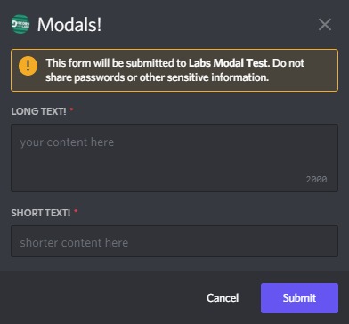
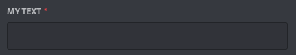
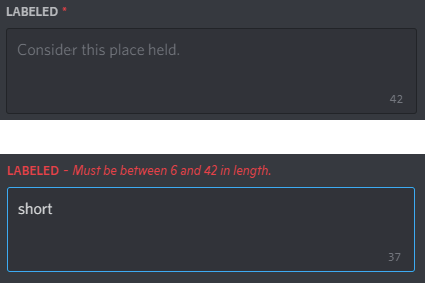

# Text Input Components

> [!WARNING]
> Text input components can only be used in 
> [modals](../modals/intro.md).

Text input components are a type of MessageComponents that can only be 
used in modals. Texts inputs can be longer (the `Paragraph`) style or 
shorter (the `Short` style). Text inputs have a variable min and max 
length.



## Creating text inputs
Text input components can be built using the `TextInputBuilder`.
The simplest text input can built with:
```cs
var tb = new TextInputBuilder()
    .WithLabel("My Text")
    .WithCustomId("text_input");
```

and would produce a component that looks like:



Additional options can be specified to control the placeholder, style, 
and min/max length of the input:
```cs
var tb = new TextInputBuilder()
    .WithLabel("Labeled")
    .WithCustomId("text_input")
	.WithStyle(TextInputStyle.Paragraph)
	.WithMinLength(6);
	.WithMaxLength(42)
	.WithRequired(true)
	.WithPlaceholder("Consider this place held.");
```



