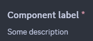
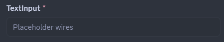
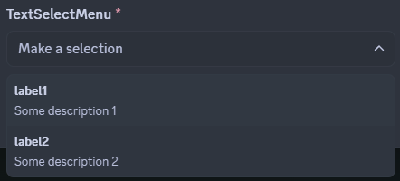
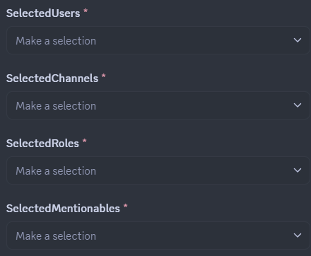
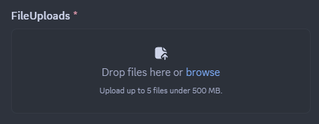
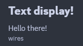

# Modals
The interaction service provides a set of tools which can be used to create and handle modals. Modals are a type of interactive component that can be used to gather input from users in a structured way.

In the Interaction Framework modals can be defined using a class that inherits `IModal`. `ModalBuilder` can be still used to create modals programmatically, but using `IModal` is the recommended way.

The title of the modal is set by implementing the `Title` property of the `IModal` interface.

[!code-csharp[Example modal](samples/modals/modal-class.cs)]

> [!NOTE]
> If you are using Modals in the interaction service it is **highly
> recommended** that you enable `PreCompiledLambdas` in your config
> to prevent performance issues.

## Responding with a modal
To respond to an interaction with a modal, you can use the `RespondWithModalAsync<TModal>` method provided by the interaction context. This method takes a generic parameter `TModal`, which should be a class that implements the `IModal` interface.
Additionally, the method can take an instance of `TModal` to pre-fill the modal with data (or alter the title).

```csharp
await RespondWithModalAsync<ExampleModal>("example-modal-custom-id");
```


## Handling modal submissions
To handle a modal you need to create a method in your interaction module and annotate it with the `ModalInteraction` attribute. The method's last parameter must be of type `TModal`, where `TModal` is the class that implements the `IModal` interface. Simitar to `ComponentInteraction` methods, parts of the custom ID can be defined with a wildcard character and extracted using method parameters.

```csharp
[ModalInteraction("example-modal-custom-id")]
public async Task HandleExampleModal(ExampleModal modal)
{
    // Handle the modal submission
}
```


## Input names

Modal components can be annotated with a description using the `InputLabel` attribute. If no label is provided, the property name will be used as the label.

```csharp
[InputLabel("Component label", "Some description")]
```




## Required inputs
Modal components are required by default. To make a component optional, you can use the `RequiredInput` attribute with the boolean parameter set to `false`.

```csharp
[RequiredInput(false)]
```


## Supported components

Modals currently support the following components:
- [Text Input](#text-input)
- Select Menus (Dropdowns)
  - [Text selects](#text-selects)
  - [User selects](#user--role--mentionable-and-channel-selects)
  - [Role selects](#user--role--mentionable-and-channel-selects)
  - [Mentionable selects](#user--role--mentionable-and-channel-selects)
  - [Channel selects](#user--role--mentionable-and-channel-selects)
- [File Uploads](#file-uploads)
- [Text Display](#text-display

## Text Input
Text inputs allow users to input text data into a modal. They can be configured with various options such as placeholder text, minimum and maximum length, and whether the input is required. Text inputs can be single-line or paragraph style.



## Select Menus
Select menus allow users to select one or more options from a dropdown list.

### Text Selects
Text selects allow users to select one or more options from a predefined list of text options.
The select menu is defined using the `ModalSelectMenu` attribute. The attribute can be used on a property of type `string`, `string[]` or an `enum` (annotated with `[Flags]` for multi-selects).

In the case of `string` and `string[]`, the options must be provided using the `ModalSelectMenuOption` attribute.

```csharp
[ModalSelectMenu("custom-id")]
[ModalSelectMenuOption("label1", "Value1", "Some description 1")]
[ModalSelectMenuOption("label2", "Value2", "Some description 2")]
public string[] TextSelectMenu { get; set; }
```



### User, Role, Mentionable and Channel Selects
User, Role, Mentionable and Channel selects allow users to select one or more entities of a specific type from a prefilled select menu. 
`ModalUserSelect`, `ModalRoleSelect`, `ModalMentionableSelect` and `ModalChannelSelect` attributes can be used on properties of type `IUser`, `IRole`, `IMentionable`, `IChannel` for single-selects, or arrays of respective types for multi-selects.

[!code-csharp[Example modal](samples/modals/prefilled-selects.cs)]


## File Uploads
File upload components allow users to upload files as part of their modal submission. A single file upload can take up to 10 attachments. The size limit for the uploaded files is determined by Discord's limits for the current context (e.g., server boost level, user's nitro status). 
The file upload component is defined using the `ModalFileUpload` attribute. The attribute can be used on a property of type `IAttachment` or `IAttachment[]`.

```csharp
[ModalFileUpload("file-upload-id", maxValues: 5)]
public IAttachment[] FileUploads { get; set; }
```


## Text Display
Text display components allow you to display read-only text within a modal. This can be useful for providing instructions or additional information to users. The text can be formatted using Markdown syntax.

The text display component is defined using the `ModalTextDisplay` attribute. The attribute can be used on a property of type `string`. The value of the property will be displayed as read-only text in the modal. In the case the property is `null`, the value provided in the attribute's optional `content` parameter will be used as a fallback.

```csharp
    [ModalTextDisplay(content: "Fallback content")]
    public string? TextDisplay { get; set; } = """
                                              # Text display!
                                              Hello there!
                                              -# wires
                                              """;
```
