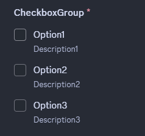
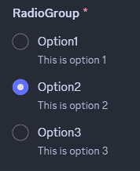

# Modals
The interaction service provides a set of tools which can be used to create and handle modals. Modals are a type of interactive component that can be used to gather input from users in a structured way.

In the Interaction Framework modals can be defined using a class that inherits `IModal`. `ModalBuilder` can be still used to create modals programmatically, but using `IModal` is the recommended way.

The title of the modal is set by implementing the `Title` property of the `IModal` interface.

[!code-csharp[Example modal](samples/modals/modal-class.cs)]

> [!NOTE]
> If you are using Modals in the interaction service it is **highly
> recommended** that you enable `InteractionServiceConfig.UseCompiledLambda`
> to prevent performance issues.

## Responding with a modal
To respond to an interaction with a modal, you can use the `RespondWithModalAsync<TModal>` method provided by the interaction context. This method takes a generic parameter `TModal`, which should be a class that implements the `IModal` interface.
Additionally, the method can take an instance of `TModal` to pre-fill the modal with data (or alter the title).

```csharp
await RespondWithModalAsync<ExampleModal>("example-modal-custom-id");
```


## Handling modal submissions
To handle a modal you need to create a method in your interaction module and annotate it with the `ModalInteraction` attribute. The method's last parameter must be of type `TModal`, where `TModal` is the class that implements the `IModal` interface. Simitar to `ComponentInteraction` methods, parts of the custom ID can be defined with a wildcard character and extracted using method parameters.

```csharp
[ModalInteraction("example-modal-custom-id")]
public async Task HandleExampleModal(ExampleModal modal)
{
    // Handle the modal submission
}
```


## Input names

Modal components can be annotated with a description using the `InputLabel` attribute. If no label is provided, the property name will be used as the label.

```csharp
[InputLabel("Component label", "Some description")]
```


## Required inputs
Modal components are required by default. To make a component optional, you can use the `RequiredInput` attribute with the boolean parameter set to `false`.

```csharp
[RequiredInput(false)]
```


## Supported components

Modals currently support the following components:
- [Text Input](#text-input)
- Select Menus (Dropdowns)
  - [Text selects](#text-selects)
  - [User selects](#user--role--mentionable-and-channel-selects)
  - [Role selects](#user--role--mentionable-and-channel-selects)
  - [Mentionable selects](#user--role--mentionable-and-channel-selects)
  - [Channel selects](#user--role--mentionable-and-channel-selects)
- [File Uploads](#file-uploads)
- [Checkboxes](#checkboxes)
- [Checkbox groups](#checkbox-groups)
- [Radio groups](#radio-groups)
- [Text Display](#text-display)

## Text Input
Text inputs allow users to input text data into a modal. They can be configured with various options such as placeholder text, minimum and maximum length, and whether the input is required. Text inputs can be single-line or paragraph style.


## Select Menus
Select menus allow users to select one or more options from a dropdown list.

### Text Selects
Text selects allow users to select one or more options from a predefined list of text options.
The select menu is defined using the `ModalSelectMenu` attribute. The attribute can be used on a property of type `string`, `string[]` or an `enum` (annotated with `[Flags]` for multi-selects).
In string selects, the default Modal TypeConverter discovers the most suitable TypeReader registered in the active `InteractionService` instance and converts `string` values to the underlying CLR type of the array property using that TypeReader. Out of the box, you can use any `IConvertible` array as the backing field of a Text Select component. 
In the case of `string`,  `string[]` or any other array, the options must be provided using the `ModalSelectMenuOption` attribute.

```csharp
[ModalSelectMenu("custom-id")]
[ModalSelectMenuOption("label1", "Value1", "Some description 1")]
[ModalSelectMenuOption("label2", "Value2", "Some description 2")]
public string[] TextSelectMenu { get; set; }
```


`enum` based select menus work similarly to the string selects, but the options are automatically generated based on the enum fields. For more information about using enums as select menu backing fields and configuring their options, refer to the [Enum options](#enum-options) section below.
Enum selects are the recommended way of implementing select menus in modals. It provides a reusable and type-safe way of accepting user inputs, as it is also possible to create generic modal classes and swap select menus in-and-out by simply changing the generic parameter on instantiation. 
### User, Role, Mentionable and Channel Selects
User, Role, Mentionable and Channel selects allow users to select one or more entities of a specific type from a prefilled select menu. 
`ModalUserSelect`, `ModalRoleSelect`, `ModalMentionableSelect` and `ModalChannelSelect` attributes can be used on properties of type `IUser`, `IRole`, `IMentionable`, `IChannel`, or any other implementation of the aforementioned interfaces(as long as the received entity type can be up-cast into it) for single-selects, or arrays of respective types for multi-selects.

[!code-csharp[Example modal](samples/modals/prefilled-selects.cs)]


For Channel selects in particular, the property type (if single entity), or the underlying type of the array can be used to restrict the type of channels available to the user. Implementations like `IStageChannel`, `IVoiceChannel`, `IDMChannel`, `IGroupChannel`, `ICategoryChannel`, `INewsChannel`, `IThreadChannel`, `ITextChannel`, `IMediaChannel`, or `IForumChannel` can be used.

Additionally for Channel Select components, channel type constraints can be defined by annotating the property with a `ChannelTypes` attribute. 
## File Uploads
File upload components allow users to upload files as part of their modal submission. A single file upload can take up to 10 attachments. The size limit for the uploaded files is determined by Discord's limits for the current context (e.g., server boost level, user's nitro status). 
The file upload component is defined using the `ModalFileUpload` attribute. The attribute can be used on a property of type `IAttachment` or `IAttachment[]`.

```csharp
[ModalFileUpload("file-upload-id", maxValues: 5)]
public IAttachment[] FileUploads { get; set; }
```


## Text Display
Text display components allow you to display read-only text within a modal. This can be useful for providing instructions or additional information to users. The text can be formatted using Markdown syntax.

The text display component is defined using the `ModalTextDisplay` attribute. The attribute can be used on a property of type `string`. The value of the property will be displayed as read-only text in the modal. In the case the property is `null`, the value provided in the attribute's optional `content` parameter will be used as a fallback.

```csharp
    [ModalTextDisplay(content: "Fallback content")]
    public string? TextDisplay { get; set; } = """
                                              # Text display!
                                              Hello there!
                                              -# wires
                                              """;
```


## Checkboxes
Checkbox component allows users to add a boolean input to their modal. It is defined using the `ModalCheckbox` attribute. The attribute can be used on a property of type `bool` for a single checkbox, or `bool[]` for a group of checkboxes.

```csharp
    [ModalCheckbox("checkbox-id")]
    public bool CheckBox { get; set; } = true;
```


## Checkbox groups
Checkbox group component allows users to select multiple options from a group of options. It is defined using the `ModalCheckboxGroup` attribute. Similarly to [select menus](#select-menus), the attribute can be used on a property with options defined by `ModalCheckboxGroupOption` attributes, or on an `enum` property with options defined by the enum fields. For more information about the latter refer to the [Enum options](#enum-options) section below.

```csharp
    [ModalCheckboxGroup("checkbox-group-id")]
    [ModalCheckboxGroupOption("Option1", "value1", "Description1")]
    [ModalCheckboxGroupOption("Option2", "value2", "Description2")]
    [ModalCheckboxGroupOption("Option3", "value3", "Description3")]
    public string[] CheckboxGroup { get; set; } = [];
```


## Radio groups
Radio group component allows users to select one option from a group of options. It is defined using the `ModalRadioGroup` attribute. Similarly to [select menus](#select-menus) and [checkbox groups](#checkbox-groups), attribute can be used on a property with options defined by `ModalRadioGroupOption` attributes, or on an `enum` property with options defined by the enum fields. For more information about the latter refer to the [Enum options](#enum-options) section below.
```csharp
    [ModalRadioGroup("radio-group-id")]
    [ModalRadioGroupOption("Option1", "value1", "Description1")]
    [ModalRadioGroupOption("Option2", "value2", "Description2")]
    [ModalRadioGroupOption("Option3", "value3", "Description3")]
    public string RadioGroup { get; set; }
```


## Modal TypeConverters
Modal TypeConverters use the same principle as Slash Command TypeConverters and Component TypeConverters to convert CLR type values to and from API entities and values. They are assigned to modal component properties by their respective CLR types (with the exception being Text Display components). Every default behaviour mentioned in this document regarding value conversions and property values can be overridden by implementing custom generic or concrete Modal TypeConverters by inheriting `ModalComponentTypeConverter` class and registering the TypeConveter to the `InteractionService` instance in use. `WriteAsync` method is invoked after the regular the component building flow is done executing with the component builder instance being used.  


## Enum options
When using `enum` properties for [select menus](#text-selects), [checkbox groups](#checkbox-groups) or [radio groups](#radio-groups), the options are automatically generated based on the enum fields. The `EnumOption` attribute can be used to configure option properties such as description, default value and `Emote` for select menu options. 

The `Hide` attribute and its derivatives can be used to conditionally hide options based on runtime logic. Custom attributes can be created by inheriting the `Hide` attribute and overriding the `Predicate` method to apply the attribute selectively during runtime.

`ChoiceDisplay` attribute can be used to set the label of the option to a custom value instead of the enum field name. 

```
    public enum ModalEnum
    {
        [EnumOption(Description = "Some description 1")]
        Value1 = 1 << 0,

        [EnumOption(Description = "Some description 2", IsDefault = true)]
        Value2 = 1 << 1,

        [EnumOption(Description = "Some description 3", Emote = "🦫")]
        Value3 = 1 << 2,

        [EnumOption(Description = "Some description 69")]
        [ChoiceDisplay("Value 42")]
        Value69 = 1 << 3,

        [Hide]
        SuperSecretOption = 1 << 31,
    }
```