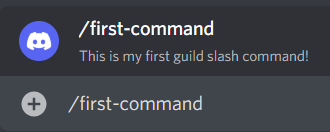
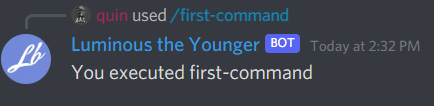

# Responding to interactions.

Interactions are the base thing sent over by Discord. Slash commands are one of the interaction types. We can listen to the `SlashCommandExecuted` event to respond to them. Lets add this to our code:

```cs
client.SlashCommandExecuted += SlashCommandHandler;

...

private async Task SlashCommandHandler(SocketSlashCommand command)
{

}
```

With every type of interaction there is a `Data` field. This is where the relevant information lives about our command that was executed. In our case, `Data` is a `SocketSlashCommandData` instance. In the data class, we can access the name of the command triggered as well as the options if there were any. For this example, we're just going to respond with the name of the command executed.

```cs
private async Task SlashCommandHandler(SocketSlashCommand command)
{
    await command.RespondAsync($"You executed {command.Data.Name}");
}
```

Let's try this out!





> [!NOTE]
> After receiving an interaction, you must respond to acknowledge it. You can choose to respond with a message immediately using `RespondAsync()` or you can choose to send a deferred response with `DeferAsync()`.
> If choosing a deferred response, the user will see a loading state for the interaction, and you'll have up to 15 minutes to edit the original deferred response using `ModifyOriginalResponseAsync()`. You can read more about response types [here](https://discord.com/developers/docs/interactions/slash-commands#interaction-response)

This seems to be working! Next, we will look at parameters for slash commands.
