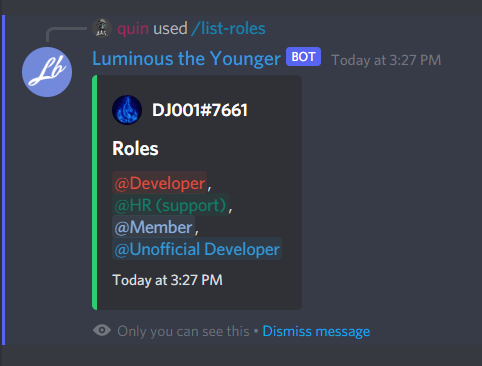

# Responding ephemerally

What is an ephemeral response? Basically, only the user who executed the command can see the result of it. In labs this is pretty simple to do.

First, we need to talk about `AlwaysAcknowledgeInteractions` in the discord config. `AlwaysAcknowledgeInteractions` will always acknowledge the message non-ephemerally, meaning any follow-up messages or responses will also be non-ephemeral. If you set `AlwaysAcknowledgeInteractions` to false, you can acknowledge interactions yourself with the ephemeral field set to your discretion.

**Note**: You don't have to run arg.AcknowledgeAsync() to capture the interaction, you can use arg.RespondAsync with a message to capture it, this also follows the ephemeral rule.

Let's start by changing our client config.

```cs
client = new DiscordSocketClient(new DiscordSocketConfig()
{
    // Add this!
    AlwaysAcknowledgeInteractions = false,
});
```

When responding with either `FollowupAsync` or `RespondAsync` you can pass in an `ephemeral` property. When setting it to true it will respond ephemerally, false and it will respond non-ephemerally.

Let's use this in our list role command.

```cs
await command.RespondAsync(embed: embedBuiler.Build(), ephemeral: true);
```

Running the command now only shows the message to us!


