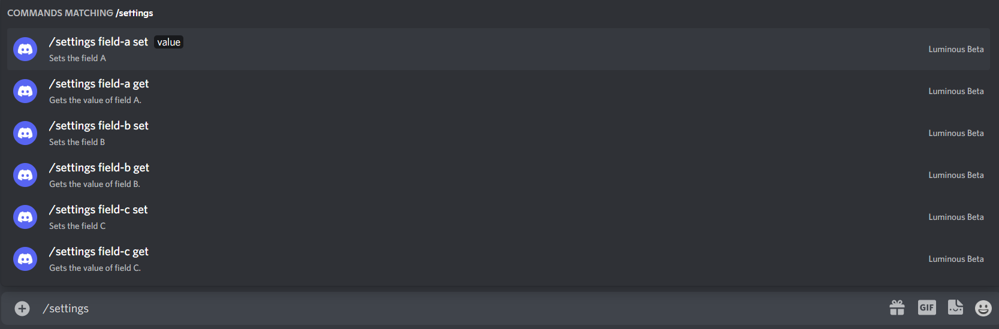
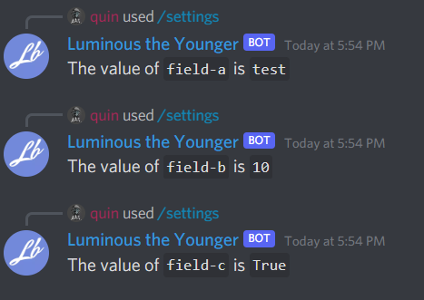
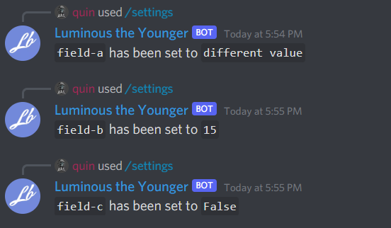

# Subcommands

Subcommands allow you to have multiple commands available in a single command. They can be useful for representing sub options for a command. For example: A settings command. Let's first look at some limitations with subcommands set by discord.

- An app can have up to 25 subcommand groups on a top-level command
- An app can have up to 25 subcommands within a subcommand group
- commands can have up to 25 `options`
- options can have up to 25 `choices`

```
VALID

command
|
|__ subcommand
|
|__ subcommand

----

command
|
|__ subcommand-group
    |
    |__ subcommand
|
|__ subcommand-group
    |
    |__ subcommand


-------

INVALID


command
|
|__ subcommand-group
    |
    |__ subcommand-group
|
|__ subcommand-group
    |
    |__ subcommand-group

----

INVALID

command
|
|__ subcommand
    |
    |__ subcommand-group
|
|__ subcommand
    |
    |__ subcommand-group
```

Let's write a settings command that can change 3 fields in our bot.

```cs
public string FieldA { get; set; } = "test";
public int FieldB { get; set; } = 10;
public bool FieldC { get; set; } = true;

public async Task Client_Ready()
{
    ulong guildId = 848176216011046962;

    var guildCommand = new SlashCommandBuilder()
        .WithName("settings")
        .WithDescription("Changes some settings within the bot.")
        .AddOption(new SlashCommandOptionBuilder()
            .WithName("field-a")
            .WithDescription("Gets or sets the field A")
            .WithType(ApplicationCommandOptionType.SubCommandGroup)
            .AddOption(new SlashCommandOptionBuilder()
                .WithName("set")
                .WithDescription("Sets the field A")
                .WithType(ApplicationCommandOptionType.SubCommand)
                .AddOption("value", ApplicationCommandOptionType.String, "the value to set the field", isRequired: true)
            ).AddOption(new SlashCommandOptionBuilder()
                .WithName("get")
                .WithDescription("Gets the value of field A.")
                .WithType(ApplicationCommandOptionType.SubCommand)
            )
        ).AddOption(new SlashCommandOptionBuilder()
            .WithName("field-b")
            .WithDescription("Gets or sets the field B")
            .WithType(ApplicationCommandOptionType.SubCommandGroup)
            .AddOption(new SlashCommandOptionBuilder()
                .WithName("set")
                .WithDescription("Sets the field B")
                .WithType(ApplicationCommandOptionType.SubCommand)
                .AddOption("value", ApplicationCommandOptionType.Integer, "the value to set the fie to.", isRequired: true)
            ).AddOption(new SlashCommandOptionBuilder()
                .WithName("get")
                .WithDescription("Gets the value of field B.")
                .WithType(ApplicationCommandOptionType.SubCommand)
            )
        ).AddOption(new SlashCommandOptionBuilder()
            .WithName("field-c")
            .WithDescription("Gets or sets the field C")
            .WithType(ApplicationCommandOptionType.SubCommandGroup)
            .AddOption(new SlashCommandOptionBuilder()
                .WithName("set")
                .WithDescription("Sets the field C")
                .WithType(ApplicationCommandOptionType.SubCommand)
                .AddOption("value", ApplicationCommandOptionType.Boolean, "the value to set the fie to.", isRequired: true)
            ).AddOption(new SlashCommandOptionBuilder()
                .WithName("get")
                .WithDescription("Gets the value of field C.")
                .WithType(ApplicationCommandOptionType.SubCommand)
            )
        );

    try
    {
        await client.Rest.CreateGuildCommand(guildCommand.Build(), guildId);
    }
    catch(ApplicationCommandException exception)
    {
        var json = JsonConvert.SerializeObject(exception.Error, Formatting.Indented);
        Console.WriteLine(json);
    }
}
```

All that code generates a command that looks like this:


Now that we have our command made, we need to handle the multiple options with this command. So lets add this into our handler:

```cs
private async Task SlashCommandHandler(SocketSlashCommand command)
{
    // Let's add a switch statement for the command name so we can handle multiple commands in one event.
    switch(command.Data.Name)
    {
        case "list-roles":
            await HandleListRoleCommand(command);
            break;
        case "settings":
            await HandleSettingsCommand(command);
            break;
    }
}

private async Task HandleSettingsCommand(SocketSlashCommand command)
{
    // First lets extract our variables
    var fieldName = command.Data.Options.First().Name;
    var getOrSet = command.Data.Options.First().Options.First().Name;
    // Since there is no value on a get command, we use the ? operator because "Options" can be null.
    var value = command.Data.Options.First().Options.First().Options?.FirstOrDefault().Value;

    switch (fieldName)
    {
        case "field-a":
            {
                if(getOrSet == "get")
                {
                    await command.RespondAsync($"The value of `field-a` is `{FieldA}`");
                }
                else if (getOrSet == "set")
                {
                    this.FieldA = (string)value;
                    await command.RespondAsync($"`field-a` has been set to `{FieldA}`");
                }
            }
            break;
        case "field-b":
            {
                if (getOrSet == "get")
                {
                    await command.RespondAsync($"The value of `field-b` is `{FieldB}`");
                }
                else if (getOrSet == "set")
                {
                    this.FieldB = (int)value;
                    await command.RespondAsync($"`field-b` has been set to `{FieldB}`");
                }
            }
            break;
        case "field-c":
            {
                if (getOrSet == "get")
                {
                    await command.RespondAsync($"The value of `field-c` is `{FieldC}`");
                }
                else if (getOrSet == "set")
                {
                    this.FieldC = (bool)value;
                    await command.RespondAsync($"`field-c` has been set to `{FieldC}`");
                }
            }
            break;
    }
}

```

Now, let's try this out! Running the 3 get commands seems to get the default values we set.



Now let's try changing each to a different value.



That has worked! Next, let't look at choices in commands.
