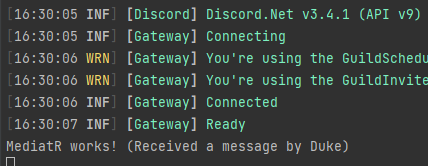

# Configuring MediatR

## Prerequisites

- A simple bot with dependency injection configured

## Downloading the required packages

You can install the following packages through your IDE or go to the NuGet link to grab the dotnet cli command.

|Name|Link|
|--|--|
| `MediatR` | [link](https://www.nuget.org/packages/MediatR) |
| `MediatR.Extensions.Microsoft.DependencyInjection` | [link](https://www.nuget.org/packages/MediatR.Extensions.Microsoft.DependencyInjection)|

## Adding MediatR to your dependency injection container

Adding MediatR to your dependency injection is made easy by the `MediatR.Extensions.Microsoft.DependencyInjection` package. You can use the following piece of code to configure it. The parameter of `.AddMediatR()` can be any type that is inside of the assembly you will have your event handlers in.

[!code-csharp[Configuring MediatR](samples/MediatrConfiguringDI.cs)]

## Creating notifications

The way MediatR publishes events throughout your applications is through notifications and notification handlers. For this guide we will create a notification to handle the `MessageReceived` event on the `DiscordSocketClient`.

[!code-csharp[Creating a notification](samples/MediatrCreatingMessageNotification.cs)]

## Creating the notification publisher / event listener

For MediatR to actually publish the events we need a way to listen for them. We will create a class to listen for discord events like so:

[!code-csharp[Creating an event listener](samples/MediatrDiscordEventListener.cs)]

The code above does a couple of things. First it receives the DiscordSocketClient from the dependency injection container. It can then use this client to register events. In this guide we will be focusing on the MessageReceived event. You register the event like any ordinary event, but inside of the handler method we will use MediatR to publish our event to all of our notification handlers.

## Adding the event listener to your dependency injection container

To start the listener we have to call the `StartAsync()` method on our `DiscordEventListener` class from inside of our main function. To do this, first register the `DiscordEventListener` class in your dependency injection container and get a reference to it in your main method.

[!code-csharp[Starting the event listener](samples/MediatrStartListener.cs)]

## Creating your notification handler

MediatR publishes notifications to all of your notification handlers that are listening for a specific notification. We will create a handler for our newly created `MessageReceivedNotification` like this:

[!code-csharp[Creating an event listener](samples/MediatrMessageReceivedHandler.cs)]

The code above implements the `INotificationHandler<>` interface provided by MediatR, this tells MediatR to dispatch `MessageReceivedNotification` notifications to this handler class.

> [!NOTE]
> You can create as many notification handlers for the same notification as you desire. That's the beauty of MediatR!

## Testing

To test if we have successfully implemented MediatR, we can start up the bot and send a message to a server the bot is in. It should print out the message we defined earlier in our `MessageReceivedHandler`.

## Adding more event types

To add more event types you can follow these steps:

1. Create a new notification class for the event. it should contain all of the parameters that the event would send. (Ex: the `MessageReceived` event takes one `SocketMessage` as an argument. The notification class should also map this argument)
2. Register the event in your `DiscordEventListener` class.
3. Create a notification handler for your new notification.
