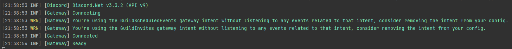

# Configuring serilog

## Prerequisites

- A basic working bot with a logging method as described in [Creating your first bot](xref:Guides.GettingStarted.FirstBot)

## Installing the Serilog package

You can install the following packages through your IDE or go to the nuget link to grab the dotnet cli command.

|Name|Link|
|--|--|
|`Serilog.Extensions.Logging`| [link](https://www.nuget.org/packages/Serilog.Extensions.Logging)|
|`Serilog.Sinks.Console`| [link](https://www.nuget.org/packages/Serilog.Sinks.Console)|

## Configuring Serilog

Serilog will be configured at the top of your async Main method, it looks like this

[!code-csharp[Configuring serilog](samples/ConfiguringSerilog.cs)]

## Modifying your logging method

For serilog to log Discord events correctly, we have to map the discord `LogSeverity` to the serilog `LogEventLevel`. You can modify your log method to look like this.

[!code-csharp[Modifying your log method](samples/ModifyLogMethod.cs)]

## Testing

If you run your application now, you should see something similar to this

## Using your new logger in other places

Now that you have set up Serilog, you can use it everywhere in your application by simply calling

[!code-csharp[Log debug sample](samples/LogDebugSample.cs)]

> [!NOTE]
> Depending on your configured log level, the log messages may or may not show up in your console. Refer to [Serilog's github page](https://github.com/serilog/serilog/wiki/Configuration-Basics#minimum-level) for more information about log levels.
