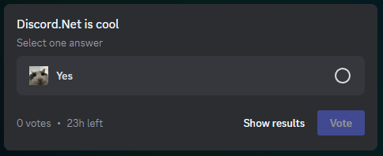

# Polls in Discord.Net

Polls are... Polls! 

This guide will explain how to use polls in your applications.

> [!NOTE]
> To get contents of polls sent by users other than your bot you need to enable `GatewayIntent.MessageContent` intent.

## Creating polls

A poll is part of a message; to send one you need to pass a [PollProperties] object into the `poll` parameter of any method that can be used to send messages. (ex. `SendMessageAsync`, `RespondAsync`, etc)

[!code-csharp[Creating polls](samples/create-poll.cs)]

> [!WARNING]
> Due to limitations of the Discord API it's not possible to send attachments in a messages with a poll.

> [!NOTE]
> It is not possible to modify polls after them being created.

## Managing polls

### Ending polls
You can expire polls early by calling `EndPollAsync` on an [IUserMessage] with a poll.

[!code-csharp[Ending polls](samples/end-poll.cs)]

### Getting poll answer voters
To get voters for a specific answer call `GetPollAnswerVotersAsync(answerId)` on an [IUserMessage] with a poll.

[!code-csharp[Getting poll answer voters](samples/get-poll-voters.cs)]

### Retrieving poll results
You can get results of a poll by simply getting an [IUserMessage] and checking the `IUserMessage.Poll.Results` property. Alteratively you can check the results on a `MessageUpdated` gateway event.

## Gateway events

### Poll votes
You can receive information about poll votes live using following events:
- `PollVoteAdded`
- `PollVoteRemoved`

> [!NOTE]
> These events are only sent if the client has `GatewayIntents.GuildMessagePolls` or `GatewayIntents.DirectMessagePolls` intents enabled. It will receive events for polls in guild or dm channels respectively.

### Poll expiry
On poll expiry the `MessageUpdated` event is fired.

[PollProperties]: xref:Discord.PollProperties
[IUserMessage]: xref:Discord.IUserMessage